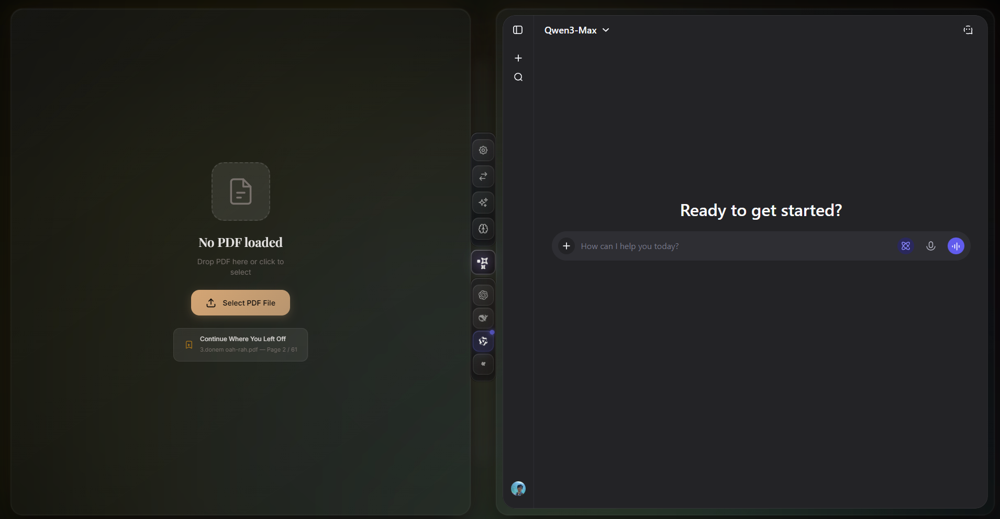
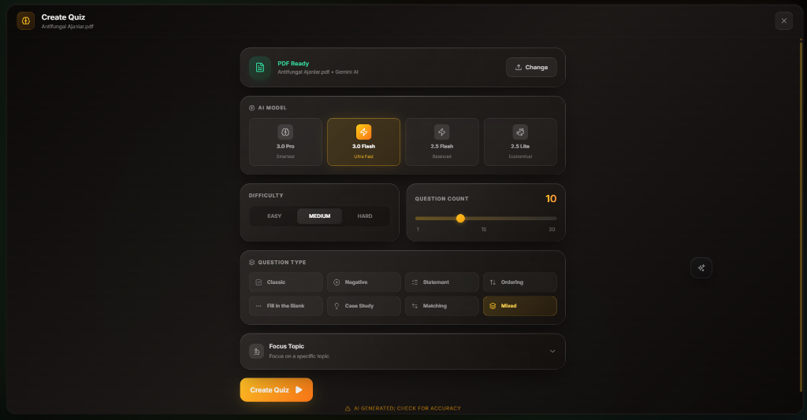
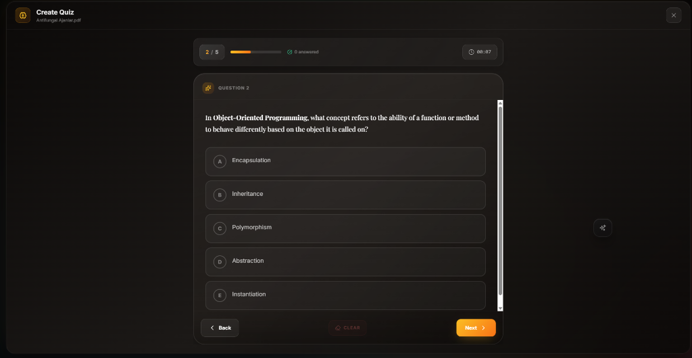
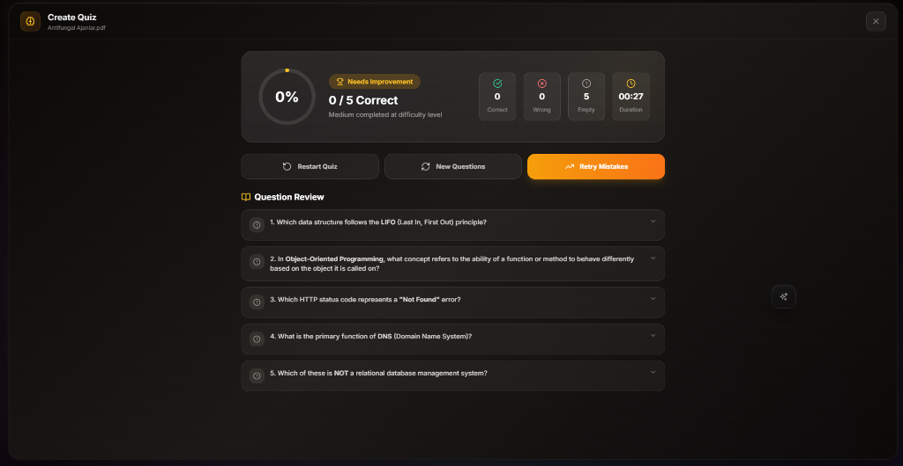

# 🧪 QuizLab Reader - AI-Powered PDF Study Tool & Quiz Generator

<p align="center">
  
</p>

<p align="center">
  <strong>The Ultimate Desktop Study Companion for Medical Students & Professionals</strong><br/>
  <em>Transform your PDF textbooks into interactive quizzes with Google Gemini AI</em>
</p>

<p align="center">
  <a href="README_TR.md">
    
  </a>
  
  
  
  
</p>

<p align="center">
  <a href="#-why-quizlab">Why QuizLab?</a> •
  <a href="#-core-features">Features</a> •
  <a href="#-installation">Installation</a> •
  <a href="#-quick-start">Quick Start</a> •
  <a href="#-tech-stack">Tech Stack</a> •
  <a href="#-architecture">Architecture</a>
</p>

---

## 📖 Table of Contents

- [Overview](#-overview)
- [Why QuizLab?](#-why-quizlab)
- [Core Features](#-core-features)
- [Screenshots](#-screenshots)
- [Installation Guide](#-installation-guide)
- [Quick Start](#-quick-start)
- [Usage Guide](#-usage-guide)
- [Tech Stack](#-tech-stack)
- [Architecture](#-architecture)
- [Security](#-security)
- [Configuration](#-configuration)
- [API Reference](#-api-reference)
- [Contributing](#-contributing)
- [License](#-license)

---

## 🎯 Overview

**QuizLab Reader** is an open-source, AI-powered desktop application designed specifically for **medical students, competitive exam candidates, and lifelong learners**. Unlike traditional PDF viewers, QuizLab combines a robust PDF reader with advanced AI capabilities to create an interactive study environment.

### What Makes QuizLab Unique?

- **Active Recall Training**: Convert passive reading into active learning with AI-generated quizzes
- **Split-Screen Workspace**: Read PDFs on one side, chat with AI on the other
- **Context-Aware AI**: Send selected text directly to AI for explanation or quiz generation
- **Multi-Platform AI Support**: Works with Google Gemini, ChatGPT, Claude, DeepSeek, and more
- **Privacy-First**: All data stays local; no cloud storage of your documents

### Perfect For:

- 📚 Medical students preparing for board exams (USMLE, TUS, etc.)
- 🎓 University students with heavy reading materials
- 💼 Professionals studying for certifications
- 🧠 Anyone using active recall for learning
- 📝 Users who want to create flashcards from PDFs

---

## 💡 Why QuizLab?

### The Problem with Traditional Study Methods

| Traditional Method | Limitation | QuizLab Solution |
|-------------------|------------|------------------|
| Passive reading | Low retention | Active recall quizzes |
| Switching apps | Context loss | Split-screen integration |
| Manual flashcards | Time-consuming | AI auto-generation |
| Generic AI chat | No PDF context | Context-aware prompts |

### Key Benefits

1. **🧠 Evidence-Based Learning**: Uses active recall and spaced repetition principles
2. **⚡ Workflow Integration**: Study without leaving your PDF
3. **🎯 Medical-Grade Questions**: AI persona specifically tuned for medical board exams
4. **🔒 Privacy**: Your documents never leave your computer
5. **💰 Free & Open Source**: No subscriptions, no limits

---

## ✨ Core Features

### 📖 Intelligent Split-Screen Workspace

The heart of QuizLab is its split-screen design:

- **Left Panel**: High-performance PDF viewer with text selection
- **Right Panel**: AI chat interface (Gemini, ChatGPT, Claude, etc.)
- **Center Hub**: Quick access toolbar for screenshots and quiz generation
- **Instant Context Transfer**: Select text in PDF → Send to AI with one click

**Features:**
- Multi-tab PDF support
- Drag-and-drop file opening
- Page navigation and search
- Zoom and rotation controls
- Text highlighting

### 🧠 Advanced Quiz Generator

Transform any PDF content into interactive quizzes:

**Question Types:**
- ✅ Multiple Choice (Classic)
- ❌ Negative Questions ("Which is NOT...")
- 🧩 Statement-Based (True/False with reasoning)
- 📋 Ordering Questions (Step sequencing)
- 🔍 Fill-in-the-Blank
- 🧠 Clinical Reasoning (Complex cases)
- 🔗 Matching Questions

**Customization Options:**
- **Difficulty**: Easy (Pre-clinical) | Medium (Clerkship) | Hard (Specialist)
- **Question Count**: 1-30 questions per generation
- **Style**: Mixed or specific question types
- **Focus Topic**: Narrow down to specific subjects
- **Language**: English or Turkish

**Medical Board Examiner Persona:**
The AI acts as a senior medical board examiner, creating questions that:
- Require clinical reasoning, not just memorization
- Include realistic patient vignettes (70% of questions)
- Have high-quality distractors (plausible wrong answers)
- Test cause-effect relationships

### 🤖 Multi-Platform AI Integration

**Built-in AI Platforms:**

| Platform | Type | Submit Mode | Special Features |
|----------|------|-------------|------------------|
| **Google Gemini** | Web + CLI | Mixed | Native quiz generation, file upload |
| **ChatGPT** | Web | Enter Key | Most popular, GPT-4 support |
| **Claude** | Web | Enter Key | Long context window |
| **DeepSeek** | Web | Enter Key | Code and reasoning |
| **Qwen** | Web | Enter Key | Multilingual |
| **Kimi** | Web | Enter Key | Chinese AI assistant |

**Magic Selector Technology:**
- Universal AI integration system
- Automatically detects input fields and send buttons
- Works with any web-based AI platform
- 3-step visual picker for configuration
- Shadow DOM support (Gemini, etc.)

### 🎨 Premium Glassmorphism UI

**Visual Customization:**
- **Background Themes**: Animated gradient or solid colors
- **Bottom Bar**: Adjustable opacity (0-100%), scale (0.7x-1.3x)
- **Compact Mode**: Icon-only toolbar option
- **Selection Colors**: Customizable PDF text highlight
- **Random Mode**: Dynamic color transitions

### 🏠 AI Home Page & Dynamic Tab Management

**New in v2.2.0:**
- **AI Home Page**: A premium landing page that serves as the command center for all your AI interactions.
- **Dynamic Startup**: Only your pinned tabs load on startup, reducing memory usage and providing a clean slate.
- **Auto-Home Navigation**: Closing all tabs or clearing the active session automatically returns you to the Home Page.
- **2D Grid Reordering**: Order your AI models and sites exactly how you want them using an intuitive 2D drag-and-drop system.
- **Glassmorphism Backdrop**: The Home Page features a beautiful translucent design that lets the underlying light-beam animations shine through.
- **Category Organization**: Dedicated sections for Open Tabs, AI Models, and Custom Sites.

**Animation & Effects:**
- GPU-accelerated transitions (Framer Motion)
- Smooth panel resizing
- Glass panel effects with backdrop blur
- Entrance and exit animations

### 📸 Screenshot to AI

Capture and analyze any content:

- **Full Page Screenshot**: Send entire PDF page to AI
- **Crop Screenshot**: Select specific area for analysis
- **Auto-Paste**: Screenshots automatically sent to active AI
- **Context Menu**: Right-click access in PDF viewer

### 🌍 Multi-Language Support

**Fully Localized:**
- 🇺🇸 English
- 🇹🇷 Turkish (Turkce)

**Extensible:** Easy to add new languages via JSON locale files

### 🔒 Privacy & Security

**Local-First Architecture:**
- ✅ All PDFs processed locally
- ✅ No cloud upload of documents
- ✅ AI conversations through your own accounts
- ✅ Settings stored in local encrypted storage
- ✅ No telemetry or tracking

**Security Features:**
- Context Bridge isolation (Electron security best practice)
- PDF path validation (prevents directory traversal)
- Magic bytes verification for PDF files
- Allowlist-based file access

### 🔄 Auto-Update System

- Automatic version checking from GitHub releases
- One-click update downloads
- Update notifications with changelogs

### 🎓 Interactive Tutorial

- Step-by-step onboarding for new users
- Non-intrusive highlight-based guidance
- Feature discovery without darkening screen

---

## 📸 Screenshots

<p align="center">
  
  <br/>
  <em>Main Interface: PDF + AI Split Screen</em>
</p>

<p align="center">
  
  <br/>
  <em>Quiz Generator: Customize Your Study Session</em>
</p>

<p align="center">
  
  <br/>
  <em>Interactive Quiz Mode with Timer</em>
</p>

<p align="center">
  
  <br/>
  <em>Detailed Results with Explanations</em>
</p>

---

## 📥 Installation Guide

### System Requirements

| Requirement | Minimum | Recommended |
|------------|---------|-------------|
| **OS** | Windows 10, macOS 10.15, Ubuntu 20.04 | Windows 11, macOS 13, Ubuntu 22.04 |
| **RAM** | 4 GB | 8 GB+ |
| **Storage** | 500 MB | 2 GB+ |
| **Internet** | Required for AI features | Broadband |

### Prerequisites

1. **Node.js 18+** and **npm**
2. **Google Account** (for Gemini features)
3. **Gemini CLI** (for quiz generation):
   ```bash
   npm install -g @google/gemini-cli
   gemini login
   ```

### Download Pre-built Binaries

Download the latest release for your platform:

- 🪟 **Windows**: `QuizlabReader-Setup-2.2.0.exe`
- 🍎 **macOS**: `QuizlabReader-2.2.0.dmg`
- 🐧 **Linux**: `QuizlabReader-2.2.0.AppImage`

[Download Latest Release](https://github.com/ozymandias-get/quizlab/releases)

### Build from Source

```bash
# Clone the repository
git clone https://github.com/ozymandias-get/quizlab.git
cd quizlab

# Install dependencies
npm install

# Run in development mode
npm run dev

# Build for production
npm run build

# Create platform-specific installers
npm run build:win    # Windows installer
npm run build:mac    # macOS .dmg
npm run build:linux  # Linux .AppImage
```

---

## 🚀 Quick Start

### 1. First Launch

1. Open QuizLab Reader
2. Complete the interactive tutorial (optional)
3. Configure your preferred AI platform in Settings

### 2. Open a PDF

- Click "Select PDF" or drag-and-drop a file
- PDF opens in the left panel
- Recent files are remembered for quick access

### 3. Configure AI (One-time Setup)

**For Gemini (Quiz Generation):**
1. Go to Settings → Gemini CLI
2. Click "Open Login Terminal"
3. Complete Google authentication

**For Web AI (ChatGPT, Claude, etc.):**
1. Go to Settings → AI Sites
2. Select your preferred platform
3. Login to the AI service in the right panel

### 4. Generate Your First Quiz

1. Select text in your PDF (optional, for context)
2. Click the Quiz button in the center hub
3. Configure difficulty and question count
4. Click "Generate Quiz"
5. Study with interactive questions!

### 5. Use Magic Selector (Optional)

For custom AI platforms:
1. Go to Settings → Selectors
2. Click "Configure Magic Selector"
3. Follow the 3-step visual guide to select input and send button
4. Auto-paste will now work with your AI

---

## 📚 Usage Guide

### Keyboard Shortcuts

| Shortcut | Action |
|----------|--------|
| `Ctrl/Cmd + O` | Open PDF |
| `Ctrl/Cmd + S` | Full page screenshot |
| `Shift + S` | Crop screenshot |
| `Ctrl/Cmd + +` | Zoom in |
| `Ctrl/Cmd + -` | Zoom out |
| `Ctrl/Cmd + 0` | Reset zoom |
| `Esc` | Close screenshot mode |

### Quiz Mode Workflow

1. **Config**: Set parameters (difficulty, count, style)
2. **Generating**: AI processes your PDF (10-30 seconds)
3. **Ready**: Review generated questions
4. **Quiz**: Answer questions with timer
5. **Results**: See score, review explanations, retry mistakes

### Study Tips

- **Active Recall**: Try to answer before seeing options
- **Spaced Repetition**: Use "Retry Mistakes" feature
- **Deep Learning**: Read explanations for wrong answers
- **Context Switching**: Use "Regenerate" for same topic, different questions

---

## 🛠 Tech Stack

### Core Technologies

| Category | Technology | Purpose |
|----------|------------|---------|
| **Framework** | Electron 40 | Cross-platform desktop |
| **Frontend** | React 19 | UI components |
| **Language** | TypeScript 5 | Type safety |
| **Build Tool** | Vite 7 | Fast bundling |
| **Styling** | TailwindCSS 3 | Utility-first CSS |
| **Animations** | Framer Motion | GPU-accelerated |
| **State** | Zustand 5 | Global state |
| **Server State** | TanStack Query | Data fetching |

### PDF Engine

- **@react-pdf-viewer**: React wrapper for PDF.js
- **PDF.js**: Mozilla's PDF rendering engine
- **Custom Protocol**: Secure `local-pdf://` streaming

### AI Integration

- **Gemini CLI**: Official Google CLI tool
- **Playwright**: Headless browser automation
- **Custom Scripts**: Shadow DOM traversal, element picking

### Testing

- **Vitest**: Unit testing
- **@testing-library/react**: Component testing
- **jsdom**: Browser environment simulation

---

## 🏗 Architecture

### High-Level Architecture

```
┌─────────────────────────────────────────────────────────────┐
│                    Electron Main Process                     │
│  ┌──────────────┐  ┌──────────────┐  ┌──────────────────┐  │
│  │  PDF Protocol │  │  Quiz CLI    │  │  AI Automation   │  │
│  │  (Security)   │  │  (Gemini)    │  │  (Magic Selector)│  │
│  └──────────────┘  └──────────────┘  └──────────────────┘  │
│  ┌──────────────┐  ┌──────────────┐  ┌──────────────────┐  │
│  │  Config Mgr  │  │  Updater     │  │  Session Mgr     │  │
│  │  (JSON)      │  │  (GitHub)    │  │  (Gemini Web)    │  │
│  └──────────────┘  └──────────────┘  └──────────────────┘  │
└─────────────────────────────────────────────────────────────┘
                              │
                    IPC (Context Bridge)
                              │
┌─────────────────────────────────────────────────────────────┐
│                   Electron Renderer Process                  │
│  ┌──────────────────────────────────────────────────────┐  │
│  │                    React App                          │  │
│  │  ┌──────────┐  ┌──────────┐  ┌──────────────────────┐│  │
│  │  │  PDF     │  │  Bottom  │  │  AI Webview          ││  │
│  │  │  Panel   │◄─┤  Hub     │─►│  (Multi-platform)    ││  │
│  │  └──────────┘  └──────────┘  └──────────────────────┘│  │
│  │  ┌──────────────────────────────────────────────────┐│  │
│  │  │         Quiz Module (State Machine)              ││  │
│  │  │   Config → Generating → Quiz → Results          ││  │
│  │  └──────────────────────────────────────────────────┘│  │
│  └──────────────────────────────────────────────────────┘  │
└─────────────────────────────────────────────────────────────┘
```

### Module Structure

```
quizlab/
├── electron/                    # Main Process
│   ├── app/                     # Entry point, window manager
│   ├── core/                    # Config, updater, helpers
│   ├── features/                # Feature modules
│   │   ├── ai/                  # AI platform registry
│   │   ├── automation/          # Magic Selector scripts
│   │   ├── gemini-web-session/  # Session management
│   │   ├── pdf/                 # PDF protocol & handlers
│   │   ├── quiz/                # Quiz CLI integration
│   │   │   ├── gemini-runner/   # Isolated CLI runner
│   │   │   ├── promptBuilder.ts # Medical prompts
│   │   │   └── quizCliHandler.ts
│   │   └── screenshot/          # Screen capture
│   └── preload/                 # Context Bridge
│
├── src/                         # Renderer Process
│   ├── app/                     # App.tsx, providers
│   ├── features/                # Feature-based modules
│   │   ├── ai/                  # AI webview components
│   │   ├── pdf/                 # PDF viewer components
│   │   ├── quiz/                # Quiz UI components
│   │   │   ├── ui/
│   │   │   │   ├── active/      # Quiz gameplay
│   │   │   │   ├── config/      # Quiz settings
│   │   │   │   └── results/     # Results & review
│   │   │   └── hooks/
│   │   ├── screenshot/          # Screenshot tool
│   │   ├── settings/            # Settings modal
│   │   └── tutorial/            # Onboarding
│   ├── platform/                # Electron bridge
│   └── shared/                  # Shared utilities
│
└── shared/                      # Cross-process types
    ├── constants/
    └── types/
```

---

## 🔐 Security

### Security Best Practices

1. **Context Isolation**: Renderer isolated from Node.js via preload script
2. **IPC Validation**: All IPC messages validated in main process
3. **Path Traversal Protection**: PDF paths normalized and validated
4. **Content Security Policy**: Strict CSP for webviews
5. **Secure Storage**: Config files with restricted permissions (0o600)

### PDF Security

```typescript
// Path validation prevents directory traversal
function isPathAllowed(pdfPath: string): boolean {
    const normalized = path.normalize(pdfPath);
    if (pdfPath.includes('\0')) return false;  // Null byte check
    if (!path.isAbsolute(resolvedPath)) return false;
    return true;
}

// PDF magic bytes verification
const buffer = Buffer.alloc(5);
await fileHandle.read(buffer, 0, 5, 0);
if (buffer.toString() !== '%PDF-') return invalid;
```

### AI Security

- No API keys stored in plain text
- Gemini CLI uses system keychain
- Web AI sessions isolated via partitions
- No automatic execution of AI-generated code

---

## ⚙️ Configuration

### Settings Categories

| Tab | Description | Key Options |
|-----|-------------|-------------|
| **Prompts** | AI prompt templates | Custom system prompts |
| **Models** | AI platform management | Enable/disable platforms |
| **Sites** | AI website URLs | Custom AI service URLs |
| **Gemini CLI** | CLI configuration | Path, authentication |
| **Gemini Web** | Web session settings | Session persistence |
| **Selectors** | Magic Selector config | Element pickers |
| **Appearance** | Visual customization | Colors, animations |
| **Language** | UI language | English, Turkish |
| **About** | App info & updates | Version checking |

### Configuration Files

All stored in user's app data directory:

- `settings.json`: Appearance, language, AI configs
- `quiz-settings.json`: Quiz generation preferences
- `ai-configs.json`: Magic Selector configurations
- `gemini-web-session.json`: Gemini web session state
- `pdf-allowlist.json`: Allowed PDF file paths

---

## 📡 API Reference

### IPC Channels

```typescript
// PDF Operations
SELECT_PDF: 'select-pdf'
GET_PDF_STREAM_URL: 'get-pdf-stream-url'
PDF_REGISTER_PATH: 'pdf:register-path'

// AI Operations
GET_AI_REGISTRY: 'get-ai-registry'
SAVE_AI_CONFIG: 'save-ai-config'
GET_AUTOMATION_SCRIPTS: 'get-automation-scripts'
FORCE_PASTE: 'force-paste-in-webview'

// Quiz Operations
GENERATE_QUIZ_CLI: 'generate-quiz-cli'
ASK_AI: 'ask-ai-assistant'
GET_QUIZ_SETTINGS: 'get-quiz-settings'
SAVE_QUIZ_SETTINGS: 'save-quiz-settings'
GET_GEMINI_CLI_PATH: 'get-gemini-cli-path'
OPEN_GEMINI_LOGIN: 'open-gemini-login'
CHECK_GEMINI_AUTH: 'check-gemini-auth'
GEMINI_LOGOUT: 'gemini-logout'

// Gemini Web Session
GEMINI_WEB_STATUS: 'gemini-web-status'
GEMINI_WEB_OPEN_LOGIN: 'gemini-web-open-login'
GEMINI_WEB_CHECK_NOW: 'gemini-web-check-now'
GEMINI_WEB_REAUTH: 'gemini-web-reauth'
GEMINI_WEB_RESET_PROFILE: 'gemini-web-reset-profile'
```

### Window API

```typescript
// Access via window.electronAPI
window.electronAPI.selectPdf(options)
window.electronAPI.quiz.generate(params)
window.electronAPI.automation.generateAutoSendScript(config, text)
window.electronAPI.captureScreen(rect)
```

---

## 🤝 Contributing

We welcome contributions! Please see [CONTRIBUTING.md](CONTRIBUTING.md) for guidelines.

### Development Setup

```bash
# Fork and clone
git clone https://github.com/your-username/quizlab.git
cd quizlab

# Install dependencies
npm install

# Run tests
npm test

# Run linting
npm run lint

# Start development
npm run dev
```

### Project Scripts

```bash
npm run dev           # Start development mode
npm run test          # Run test suite
npm run test:coverage # Run tests with coverage
npm run lint          # Run ESLint
npm run typecheck     # TypeScript type checking
npm run build         # Build for production
npm run build:win     # Build Windows installer
npm run build:mac     # Build macOS DMG
npm run build:linux   # Build Linux AppImage
```

---

## 🐛 Troubleshooting

### Common Issues

**Quiz Generation Fails**
- Ensure Gemini CLI is installed: `npm install -g @google/gemini-cli`
- Check authentication: `gemini login`
- Verify PDF is not corrupted or password-protected

**AI Webview Not Loading**
- Check internet connection
- Try refreshing (Ctrl+R)
- Clear cache in Settings → About

**Magic Selector Not Working**
- Ensure you're on the AI platform's chat page
- Try reloading the webview
- Reconfigure selectors in Settings

**PDF Not Opening**
- Verify file is a valid PDF
- Check file is not larger than 50MB
- Try dragging file into window instead of dialog

### Debug Mode

```bash
# Run with DevTools open
npm run dev

# Check console for errors
# View network requests in DevTools
```

---

## 📄 License

This project is licensed under the **MIT License** - see [LICENSE](LICENSE) file for details.

---

## 🙏 Acknowledgments

- **Google Gemini Team**: For the powerful AI API
- **Electron Team**: For the cross-platform framework
- **React PDF Viewer**: For the excellent PDF component
- **Framer Motion**: For smooth animations
- **All Contributors**: Who helped make this project better

---

<p align="center">
  <strong>Made with love for learners everywhere</strong>
</p>

<p align="center">
  <a href="#-quizlab-reader---ai-powered-pdf-study-tool--quiz-generator">Back to Top</a>
</p>
