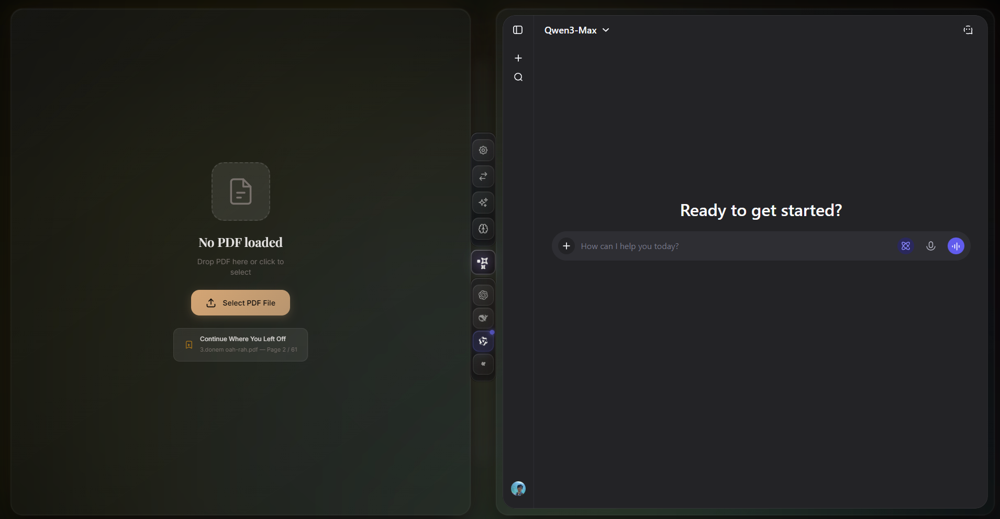
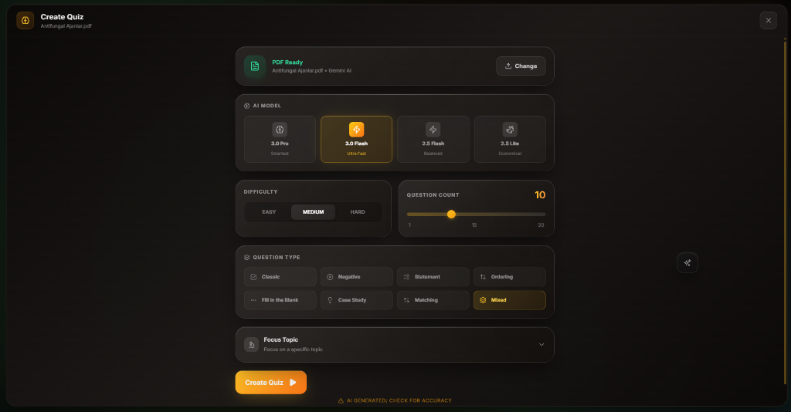
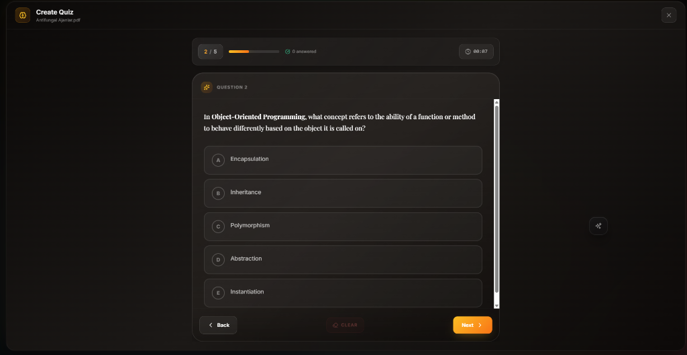
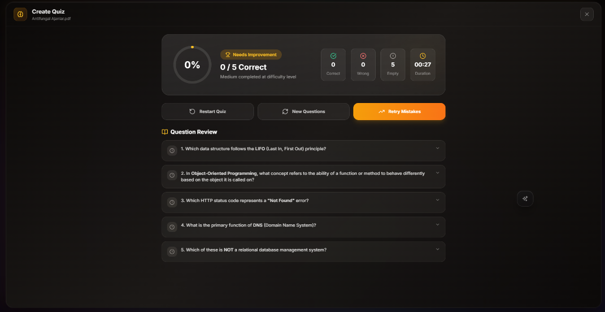
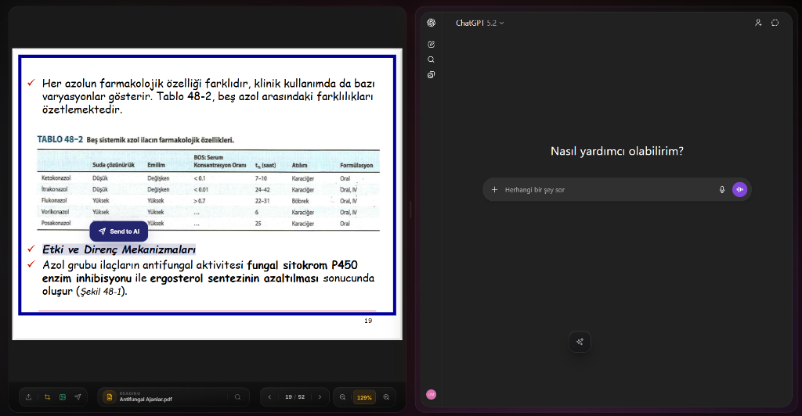

# QuizLab Reader 📚✨

[](README.md)   

> **🇺🇸 [Click here for English Documentation](README.md)**

**QuizLab Reader**, PDF okuma deneyimini gelişmiş **Yapay Zeka** yetenekleriyle birleştiren, öğrenciler ve araştırmacılar için tasarlanmış modern bir masaüstü uygulamasıdır.

Sıradan uygulamaların aksine, QuizLab karmaşık API anahtarlarıyla uğraşmanızı gerektirmez. Doğrudan **Google Gemini CLI** entegrasyonu ile yerel bir sınav oluşturucu sunar ve benzersiz **"Sihirli Seçici" (Magic Selector)** teknolojisi sayesinde tarayıcı tabanlı *herhangi bir* yapay zekayı (ChatGPT, Claude, DeepSeek) uygulamanın bir parçası gibi kullanmanıza olanak tanır.


*Çift panelli arayüz: Solda PDF dokümanınız, sağda dilediğiniz yapay zeka asistanı.*

---

## 🚀 Temel Özellikler

### 🧠 Yerel Gemini Entegrasyonu ve Sınav Modülü

Google Gemini CLI kullanarak PDF'lerinizden saniyeler içinde zenginleştirilmiş sınavlar oluşturun.

| Sınav Ayarları | Soru Çözme Arayüzü | Detaylı Sonuçlar |
| :---: | :---: | :---: |
|  |  |  |
| *Zorluk seviyesi ve soru sayısı seçimi* | *İnteraktif soru çözme ekranı* | *Puanlama ve doğru/yanlış analizi* |

### 🪄 "Sihirli Seçici" (Magic Selector) ile Kesintisiz Entegrasyon

"Oku ve Sor" iş akışını en üst düzeye çıkarın.


*PDF üzerinden metni seçin ve "Send to AI" butonuna tıklayın. Seçtiğiniz yapay zeka (ChatGPT, Claude vb.) anında yanıtlasın.*

### 📖 Gelişmiş PDF ve Çalışma Araçları

* **Bölünmüş Ekran (Split-Screen):** Sol panelde ders notlarınız, sağ panelde yapay zeka asistanınız.
* **Akıllı Bağlam Menüsü:** Metin seçtiğinizde açılan menü ile anında Özet Çıkar, Çeviri Yap veya Kavram Açıkla.
* **Ekran Görüntüsü Analizi:** PDF'teki bir grafiği kesip, anında yapay zekaya görsel olarak sorabilirsiniz.

## 🏗 Teknoloji Yığını

Uygulama, performans ve modülerlik için en modern teknolojilerle geliştirilmiştir:

* **Çekirdek (Core):**
  * [Electron](https://www.electronjs.org/): Masaüstü entegrasyonu (IPC, Shell)
  * [React 18](https://reactjs.org/): Kullanıcı arayüzü
  * [TypeScript](https://www.typescriptlang.org/): Tip güvenliği ve ölçeklenebilirlik
  * [Vite](https://vitejs.dev/): Ultra hızlı geliştirme sunucusu ve bundler

* **Arayüz & Tasarım (UI/UX):**
  * [TailwindCSS](https://tailwindcss.com/): Utility-first CSS framework
  * [Framer Motion](https://www.framer.com/motion/): Akıcı animasyonlar ve geçişler
  * [Lucide React](https://lucide.dev/): Modern ve tutarlı ikon seti
  * [Headless UI](https://headlessui.com/): Erişilebilir UI bileşenleri

* **PDF Motoru:**
  * [@react-pdf-viewer](https://react-pdf-viewer.dev/): Yüksek performanslı PDF görüntüleme
  * [PDF.js](https://mozilla.github.io/pdf.js/): PDF okuma ve işleme altyapısı

* **Yapay Zeka & Entegrasyon:**
  * **Google Gemini CLI:** `@google/gemini-cli` ile yerel quiz üretimi
  * **DOM Otomasyonu:** "Sihirli Seçici" için özel geliştirilmiş DOM enjeksiyon motoru

* **Paketleme & Dağıtım:**
  * [Electron Builder](https://www.electron.build/): Windows, macOS ve Linux için installer oluşturma

---

## 🛠 Kurulum

### Gereksinimler

* Node.js (v18 veya üzeri)
* Git
* Bir Google Hesabı (Gemini özellikleri için)

### Geliştirici Kurulumu

1. **Repoyu klonlayın**

    ```bash
    git clone https://github.com/ozymandias-get/quizlab.git
    cd quizlab
    ```

2. **Bağımlılıkları yükleyin**

    ```bash
    npm install
    ```

    *Not: Bu işlem, quiz üretimi için gerekli olan `@google/gemini-cli` paketini de yükleyecektir.*

3. **Geliştirme Modunda Çalıştırın**

    ```bash
    npm run dev
    ```

    *Bu komut Vite sunucusunu ve Electron ana sürecini eş zamanlı olarak başlatır.*

### Uygulamayı Derleme (Build)

İşletim sisteminiz için çalıştırılabilir dosya (.exe, .dmg, .AppImage) oluşturmak için:

* **Windows:** `npm run build:win` (`release/` klasöründe .exe oluşturur)
* **macOS:** `npm run build:mac`
* **Linux:** `npm run build:linux`

---

## 🎮 Nasıl Kullanılır?

### 1. Google Gemini Bağlantısı (Quiz İçin)

Uygulama **Gemini Developer CLI** kullanır. API Key kopyalamakla uğraşmazsınız.

1. Uygulamada **Ayarlar** veya **Quiz** sekmesine gidin.
2. **"Google ile Giriş Yap"** (Login with Google) butonuna tıklayın.
3. Açılan terminal penceresindeki linki tarayıcıda açın, izin verin ve size verilen kodu kopyalayın.
4. Kodu tekrar terminale yapıştırın.
5. Durum **"Bağlandı"** olduğunda artık dökümanlarınızdan sınırsız quiz oluşturabilirsiniz.

### 2. Sihirli Seçici Kurulumu (Chat İçin)

1. Sağ taraftaki **AI Paneli**ni açın.
2. Favori sohbet sitenize gidin (örn. `chatgpt.com`).
3. Alt çubuktaki **Sihirli Değnek 🪄** ikonuna tıklayın.
4. **Adım 1:** Sitedeki mesaj yazma kutusuna tıklayın.
5. **Adım 2:** Sitedeki gönder (send) butonuna tıklayın.
6. Artık PDF okurken seçtiğiniz metinler otomatik olarak bu siteye gönderilecektir.

---

## 📂 Proje Yapısı

```bash
quizlab-reader/
├── backend/                 # Electron Ana Süreci (Main Process)
│   ├── main/               # Ana giriş noktaları (IPC, pencere yönetimi)
│   └── preload/            # Preload scriptleri (Güvenli köprü)
├── frontend/                # React Arayüz Süreci (Renderer Process)
│   ├── components/         #
│   │   ├── pdf/            # Özel PDF Görüntüleyici bileşenleri
│   │   ├── QuizModule/     # Gemini CLI entegrasyonu ve Quiz arayüzü
│   │   └── ...
│   ├── hooks/              # Özel hook'lar (useAiSender, usePdfSelection)
│   ├── locales/            # Dil dosyaları (en, tr)
│   └── styles/             # Tailwind ve CSS Modülleri
├── resources/               # Statik varlıklar (ikonlar, görsel materyaller)
├── installer/               # Windows için NSIS yükleyici ayarları
└── package.json            # Bağımlılıklar (@google/gemini-cli dahil)
```

## 🤝 Katkıda Bulunma

Katkılarınızı bekliyoruz! Lütfen bir Pull Request göndermekten çekinmeyin.

1. Fork'layın
2. Branch oluşturun (`git checkout -b ozellik/YeniOzellik`)
3. Commit yapın (`git commit -m 'Yeni özellik eklendi'`)
4. Push'layın (`git push origin ozellik/YeniOzellik`)
5. Pull Request açın

---

## 📄 Lisans

Bu proje **MIT Lisansı** ile lisanslanmıştır - detaylar için [LICENSE](LICENSE) dosyasına bakabilirsiniz.
