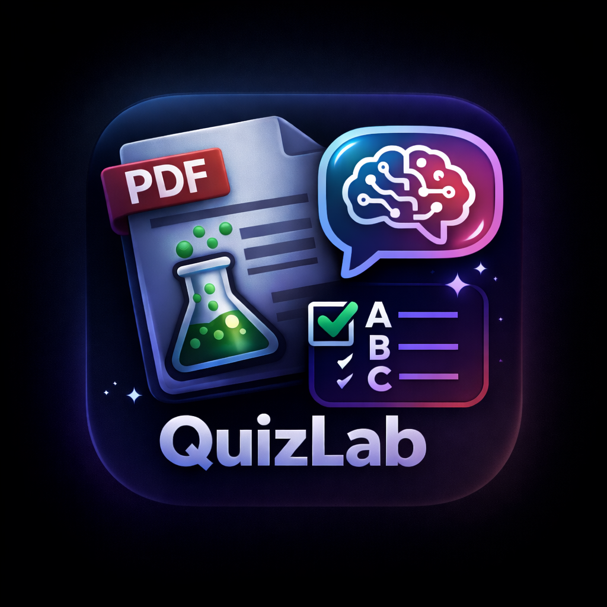
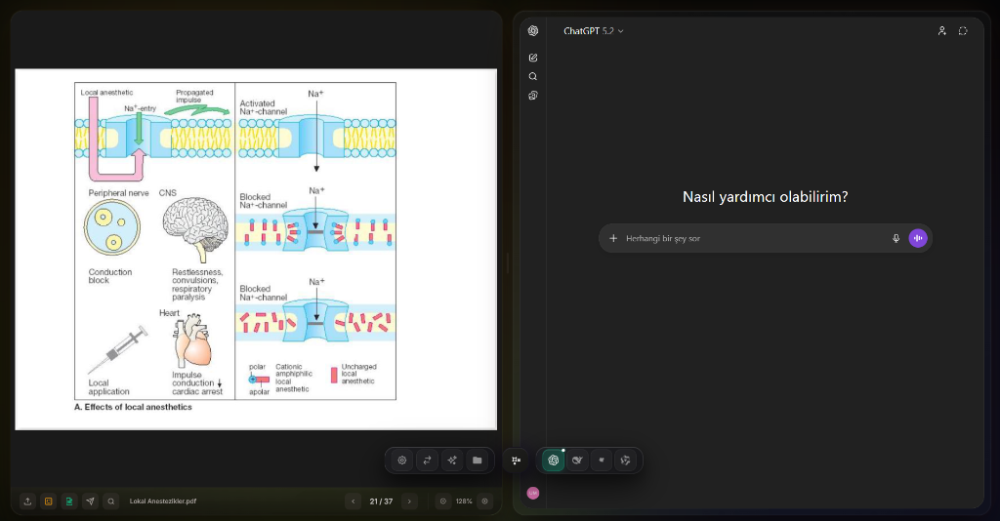
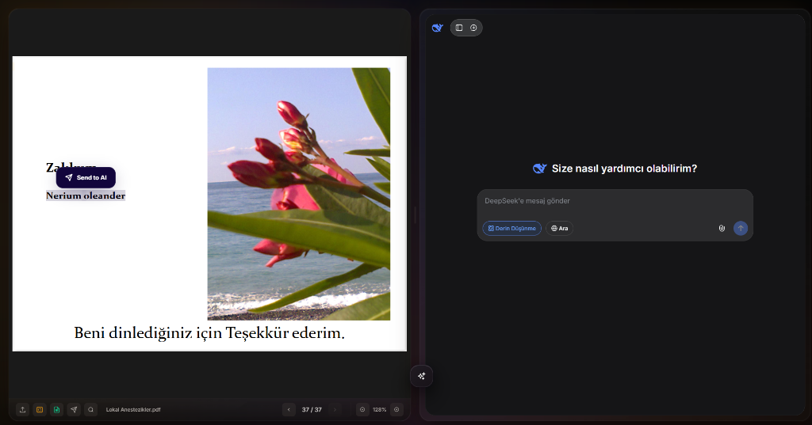
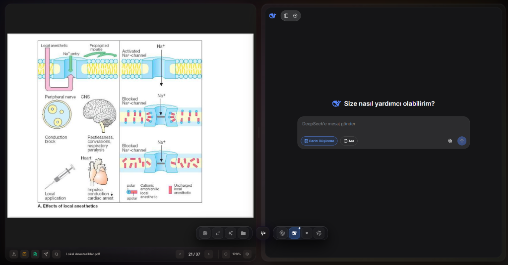
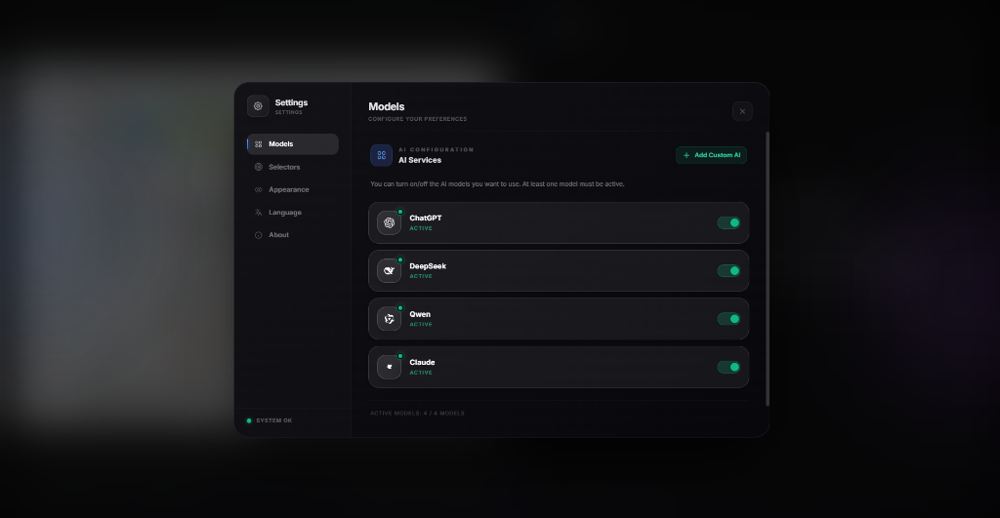
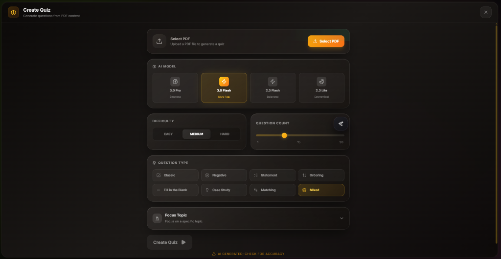
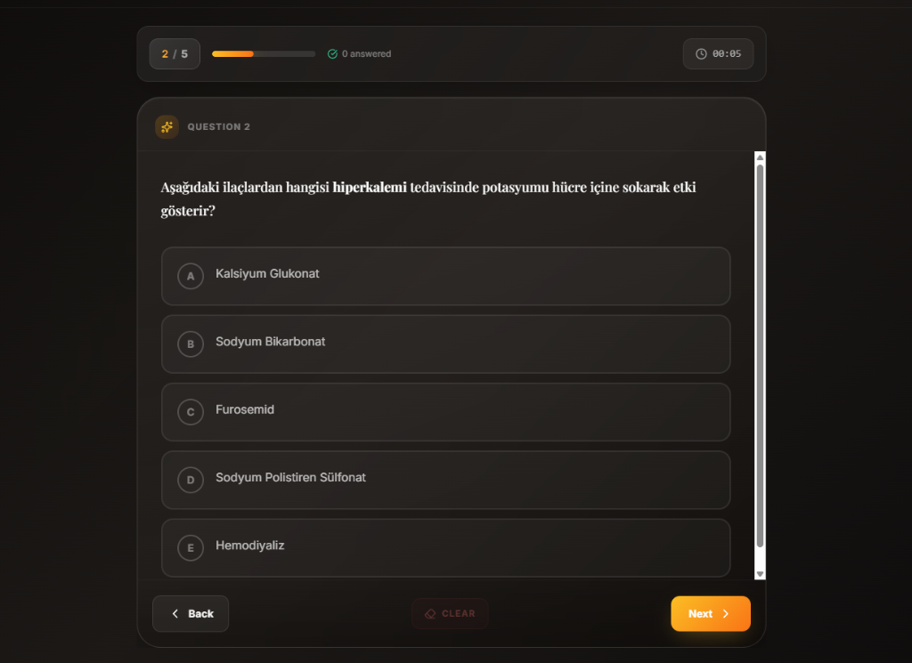
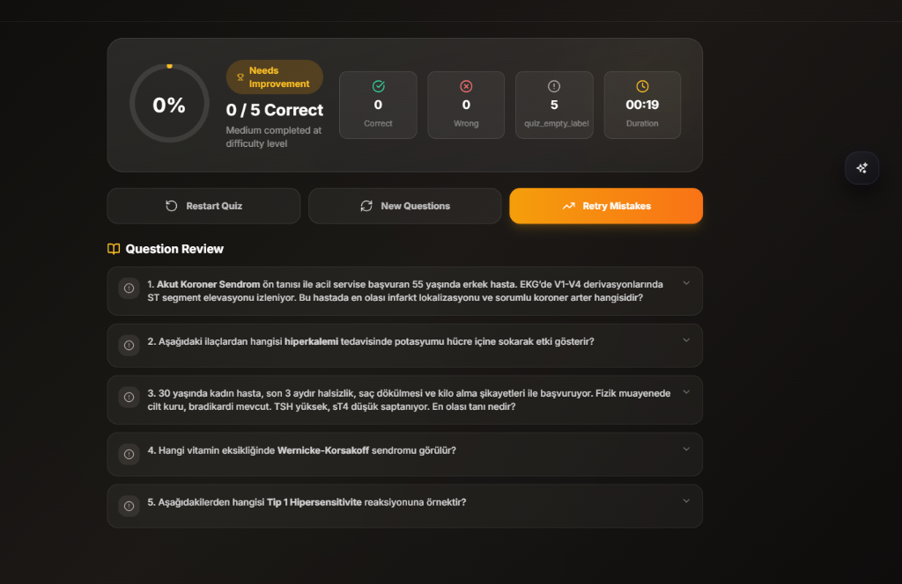

<p align="center">
  
</p>

<p align="center">
  
  
  
  
  
  
</p>

<h1 align="center">Quizlab Reader</h1>

<p align="center">
  <strong>PDF okuma, yapay zeka destekli araştırma ve akıllı quiz oluşturma için premium, bölünmüş ekranlı masaüstü uygulaması.</strong>
</p>

<p align="center">
  <a href="./README.md">🇬🇧 English</a>
</p>

---

## 📸 Ekran Görüntüleri

<p align="center">
  
  <br><em>PDF görüntüleyici ve ChatGPT entegrasyonu ile bölünmüş ekran arayüzü</em>
</p>

<p align="center">
  
  <br><em>DeepSeek AI asistanı ve AI'ya Gönder özelliği ile PDF okuma</em>
</p>

<p align="center">
  
  <br><em>DeepSeek ile Derin Düşünme ve Web Arama özellikleri</em>
</p>

<p align="center">
  
  <br><em>AI model yapılandırması ile modern ayarlar paneli</em>
</p>

### 🧠 AI Destekli Quiz Modülü

<p align="center">
  
  <br><em>Çoklu AI modeli ve soru tipleri ile gelişmiş quiz yapılandırması</em>
</p>

<p align="center">
  
  <br><em>İlerleme takibi ve zamanlayıcı ile etkileşimli quiz çözme deneyimi</em>
</p>

<p align="center">
  
  <br><em>Soru incelemesi ve yeniden deneme seçenekleri ile kapsamlı quiz sonuçları</em>
</p>

---

## 🎯 Genel Bakış

**Quizlab Reader**, öğrenciler, araştırmacılar ve ileri düzey kullanıcılar için tasarlanmış son teknoloji bir masaüstü uygulamasıdır. PDF belgelerini okuyabileceğiniz, çeşitli AI platformlarıyla etkileşimde bulunabileceğiniz ve çalışma materyallerinizden akıllı quizler oluşturabileceğiniz akıcı, glassmorphism tasarımlı bir arayüz sunar. **Google Gemini CLI** ile desteklenen uygulama, çalışma seanslarınızı verimli, AI destekli bir öğrenme deneyimine dönüştürür.

---

## ✨ Temel Özellikler

| Özellik | Açıklama |
|---------|----------|
| 📄 **Gelişmiş PDF Görüntüleyici** | PDF.js ile yüksek performanslı render, akıcı kaydırma, yakınlaştırma kontrolleri, metin seçimi ve sayfa navigasyonu. |
| 🤖 **Çoklu AI Ekosistemi** | **ChatGPT, Claude, DeepSeek, Qwen** için yerel destek ve özel AI platformları ekleme imkanı. |
| 🧠 **AI Quiz Oluşturucu** | **Gemini CLI** kullanarak PDF içeriğinden çoklu soru tipi ve zorluk seviyesi ile akıllı quizler oluşturun. |
| ⚡ **AI'ya Gönder** | PDF'lerden metin seçin veya ekran görüntüsü alın ve tek tıklamayla aktif AI'nıza anında gönderin. |
| 🎨 **Premium Estetik** | Dinamik animasyonlu blob arka planları, bulanıklaştırma efektleri ve akıcı geçişlerle çarpıcı glassmorphism UI. |
| 📁 **Akıllı Dosya Gezgini** | Sürükle-bırak desteği ve klasör organizasyonu ile entegre PDF kütüphane yönetimi. |
| 📸 **Ekran Görüntüsü Aracı** | PDF sayfalarının belirli alanlarını yakalayın ve analiz için görsel yetenekli AI'lara doğrudan gönderin. |
| 🌐 **Çoklu Dil Desteği** | **İngilizce** ve **Türkçe** olarak tamamen yerelleştirilmiş arayüz. |
| ⚙️ **Derin Özelleştirme** | Görünüm, AI modelleri, CSS seçicileri ve arayüz tercihleri için kapsamlı ayarlar. |
| 🔄 **Otomatik Güncellemeler** | Sorunsuz güncellemeler için GitHub Releases entegrasyonu ile yerleşik otomatik güncelleyici. |
| 🔒 **Gizlilik Odaklı** | Tüm AI etkileşimleri gömülü webview'larda gerçekleşir - API anahtarlarınız AI sağlayıcılarında kalır. |

---

## 🆕 v3.1.0'daki Yenilikler

### 🧠 AI Quiz Modülü
- **Gemini CLI Entegrasyonu:** Google Gemini AI modelleri (2.5 Pro, 3.0 Flash, 2.5 Flash, 2.5 Lite) kullanarak quiz oluşturma
- **8 Soru Tipi:** Klasik, Olumsuz, Doğru/Yanlış, Sıralama, Boşluk Doldurma, Vaka Çalışması, Eşleştirme ve Karışık
- **Ayarlanabilir Zorluk:** Kolay, Orta ve Zor zorluk seviyeleri
- **Odak Konuları:** PDF içeriğiniz dahilinde isteğe bağlı olarak belirli konulara odaklanma
- **Etkileşimli Quiz Çözme:** Gerçek zamanlı ilerleme takibi, zamanlayıcı ve anında geri bildirim
- **Kapsamlı Sonuçlar:** Performans analitiği, soru incelemesi ve yanlışları yeniden deneme özelliği
- **Yeni Sorular:** Aynı içerikten yeniden başlamadan yeni sorular oluşturma

### 💎 Premium UI Yenileme
- **Animasyonlu Arka Planlar:** Organik hareketli yüksek performanslı canvas tabanlı animasyonlu blob'lar
- **Glassmorphism Tasarım:** Bulanıklaştırma efektleri ve şık kenarlıklarla her bileşen yeniden tasarlandı
- **Dikey Ayarlar Navigasyonu:** Ayrı sekmelerle (Modeller, Seçiciler, Görünüm, Dil, Hakkında) düzenli ayarlar menüsü

### 🤖 Geliştirilmiş AI Entegrasyonu
- **Genişletilmiş Platformlar:** Özel AI ekleme ile **ChatGPT, Claude, DeepSeek, Qwen** desteği
- **Akıllı Otomasyon:** "AI'ya Gönder" işlevselliği için sağlam script enjeksiyon motoru
- **Oturum Kalıcılığı:** Yeniden başlatmalarda oturumunuzu korumak için güvenilir çerez yönetimi

### 🛠️ Temel İyileştirmeler
- **Modüler Mimari:** Backend (Electron) ve frontend (React) arasında temiz ayrım
- **Performans Optimizasyonu:** Animasyonlar ve webview yaşam döngüsü için azaltılmış CPU kullanımı
- **Güvenlik Güçlendirmesi:** Yol doğrulama ve komut enjeksiyon önleme ile güvenli Gemini CLI entegrasyonu

---

## 📁 Proje Yapısı

```
quizlab-reader/
├── backend/                         # Electron Backend
│   ├── main/                        # Ana İşlem
│   │   ├── index.js                 # Uygulama girişi ve yaşam döngüsü yönetimi
│   │   ├── windowManager.js         # Pencere ve webview koordinasyonu
│   │   ├── ipcHandlers.js           # Main/Renderer IPC iletişimi
│   │   ├── pdfProtocol.js           # Yerel PDF yükleme için özel protokol
│   │   ├── updater.js               # Otomatik güncelleme işlevselliği
│   │   └── constants.js             # Backend sabitleri
│   │
│   ├── preload/                     # Güvenli Köprü
│   │   └── index.js                 # Renderer işlemi için açık API'ler
│   │
│   └── modules/                     # Backend Modülleri
│       ├── ai/                      # AI Entegrasyonu
│       │   ├── aiManager.js         # AI platform orkestrasyonu
│       │   └── platforms/           # Platforma özel yapılandırmalar
│       │       ├── chatgpt.js       # ChatGPT seçicileri ve scriptleri
│       │       ├── claude.js        # Claude seçicileri ve scriptleri
│       │       ├── deepseek.js      # DeepSeek seçicileri ve scriptleri
│       │       └── qwen.js          # Qwen seçicileri ve scriptleri
│       │
│       ├── automation/              # Otomasyon Motoru
│       │   ├── automationScripts.js # Metin/görsel enjeksiyon scriptleri
│       │   ├── userElementPicker.js # Özel element seçici aracı
│       │   └── picker/              # Element seçici yardımcıları
│       │
│       └── quiz/                    # Quiz Oluşturma Motoru
│           ├── geminiService.js     # Gemini CLI iletişim servisi
│           ├── promptBuilder.js     # Quiz için AI prompt oluşturma
│           └── quizCliHandler.js    # CLI işlem yönetimi
│
├── frontend/                        # React Frontend
│   ├── App.jsx                      # Ana uygulama bileşeni
│   ├── main.jsx                     # React giriş noktası
│   ├── index.html                   # HTML şablonu
│   │
│   ├── components/                  # UI Bileşenleri
│   │   ├── AiWebview.jsx            # Yönetilen AI tarayıcı webview'ı
│   │   ├── AppBackground.jsx        # Animasyonlu blob arka planı
│   │   ├── LeftPanel.jsx            # Sol kenar çubuğu kapsayıcısı
│   │   ├── ScreenshotTool.jsx       # PDF ekran görüntüsü yakalama
│   │   ├── SettingsModal.jsx        # Ana ayarlar modal'ı
│   │   ├── FloatingButton.jsx       # Yüzen eylem düğmesi
│   │   ├── UpdateBanner.jsx         # Güncelleme bildirim banner'ı
│   │   ├── UsageAssistant.jsx       # Başlangıç asistanı
│   │   ├── ErrorBoundary.jsx        # Hata yakalama sarmalayıcısı
│   │   ├── AestheticLoader.jsx      # Yükleme animasyonları
│   │   ├── Icons.jsx                # SVG ikon bileşenleri
│   │   │
│   │   ├── QuizModule/              # AI Quiz Bileşenleri
│   │   │   ├── QuizModule.jsx       # Ana quiz kapsayıcısı ve durumu
│   │   │   ├── QuizConfigPanel.jsx  # Quiz yapılandırma arayüzü
│   │   │   ├── QuizGenerating.jsx   # Quiz oluşturma yükleme durumu
│   │   │   ├── QuizActive.jsx       # Etkileşimli quiz çözme arayüzü
│   │   │   ├── QuizResults.jsx      # Sonuçlar ve inceleme gösterimi
│   │   │   └── index.js             # Modül dışa aktarımları
│   │   │
│   │   ├── pdf/                     # PDF Görüntüleyici Bileşenleri
│   │   │   ├── PdfViewer.jsx        # Ana PDF görüntüleyici
│   │   │   ├── PdfToolbar.jsx       # PDF araç çubuğu kontrolleri
│   │   │   ├── PdfSearchBar.jsx     # PDF metin araması
│   │   │   ├── PdfPlaceholder.jsx   # Boş durum yer tutucusu
│   │   │   └── hooks/               # PDF'e özel hook'lar
│   │   │
│   │   ├── settings/                # Ayar Sekmeleri
│   │   │   ├── ModelsTab.jsx        # AI modelleri yapılandırması
│   │   │   ├── SelectorsTab.jsx     # CSS seçici özelleştirmesi
│   │   │   ├── AppearanceTab.jsx    # Tema ve görsel ayarlar
│   │   │   ├── LanguageTab.jsx      # Dil seçimi
│   │   │   ├── AboutTab.jsx         # Uygulama bilgisi ve krediler
│   │   │   └── ColorPicker.jsx      # Renk seçimi yardımcısı
│   │   │
│   │   ├── BottomBar/               # Alt Araç Çubuğu
│   │   ├── FileExplorer/            # Dosya gezgini kenar çubuğu
│   │   ├── SplashScreen/            # Uygulama yükleme ekranı
│   │   ├── Toast/                   # Toast bildirimleri
│   │   └── tutorial/                # Öğretici bileşenler
│   │
│   ├── context/                     # React Context Sağlayıcıları
│   │   ├── AiContext.jsx            # AI durum yönetimi
│   │   ├── FileContext.jsx          # Dosya/PDF durum yönetimi
│   │   ├── AppearanceContext.jsx    # Tema ve görünüm durumu
│   │   ├── LanguageContext.jsx      # i18n durum yönetimi
│   │   ├── ToastContext.jsx         # Toast bildirim durumu
│   │   ├── UpdateContext.jsx        # Otomatik güncelleme durumu
│   │   ├── NavigationContext.jsx    # Navigasyon durumu
│   │   └── AppToolContext.jsx       # Uygulama araçları durumu
│   │
│   ├── hooks/                       # Özel React Hook'ları
│   │   ├── useAiSender.js           # AI mesaj gönderme mantığı
│   │   ├── useElementPicker.js      # Element seçici işlevselliği
│   │   ├── useLocalStorage.js       # Kalıcı depolama hook'u
│   │   ├── usePanelResize.js        # Yeniden boyutlandırılabilir panel mantığı
│   │   ├── useScreenshot.js         # Ekran görüntüsü yakalama hook'u
│   │   ├── useSettings.js           # Ayarlar yönetimi hook'u
│   │   └── webview/                 # Webview'a özel hook'lar
│   │
│   ├── locales/                     # Çeviriler
│   │   ├── en.json                  # İngilizce çeviriler
│   │   └── tr.json                  # Türkçe çeviriler
│   │
│   ├── constants/                   # Frontend Sabitleri
│   │   ├── appConstants.js          # Uygulama geneli sabitler
│   │   ├── appearance.js            # Görünüm seçenekleri
│   │   ├── storageKeys.js           # LocalStorage anahtarları
│   │   └── translations.js          # Çeviri yardımcıları
│   │
│   ├── styles/                      # CSS Stilleri
│   │   ├── index.css                # Ana CSS giriş dosyası
│   │   └── modules/                 # CSS Modülleri
│   │       ├── _aesthetic-loader.css
│   │       ├── _animations.css
│   │       ├── _backgrounds.css
│   │       ├── _base.css
│   │       ├── _buttons.css
│   │       ├── _floating-bar.css
│   │       ├── _fonts.css
│   │       ├── _glass-panel.css
│   │       ├── _pdf-viewer.css
│   │       ├── _quiz.css            # Quiz modülü stilleri
│   │       ├── _resizer.css
│   │       ├── _screenshot.css
│   │       ├── _splash.css
│   │       └── _utilities.css
│   │
│   └── utils/                       # Yardımcı Fonksiyonlar
│       ├── fileUtils.js             # Dosya işleme yardımcıları
│       ├── logger.js                # Loglama yardımcısı
│       ├── uiUtils.js               # UI yardımcı fonksiyonları
│       └── webviewUtils.js          # Webview yardımcıları
│
├── resources/                       # Uygulama Kaynakları
│   └── icon.png                     # Uygulama ikonu
│
├── installer/                       # Yükleyici Yapılandırması
│   └── installer.nsh                # NSIS yükleyici scripti
│
├── docs/                            # Dokümantasyon
│   └── screenshots/                 # Uygulama ekran görüntüleri
│
├── package.json                     # Bağımlılıklar ve scriptler
├── vite.config.js                   # Vite build yapılandırması
├── tailwind.config.js               # Tailwind CSS yapılandırması
├── postcss.config.js                # PostCSS yapılandırması
└── vitest.config.js                 # Test yapılandırması
```

---

## 🚀 Başlarken

### Gereksinimler
- **Node.js** 18.x veya üstü
- **npm** 9.x veya üstü
- **Gemini CLI** (Quiz Modülü için) - [Kurulum Rehberi](https://github.com/google-gemini/gemini-cli)

### Gemini CLI Kurulumu

Quiz Modülü, Google'ın Gemini CLI'ının kurulu ve kimlik doğrulaması yapılmış olmasını gerektirir:

```bash
# Gemini CLI'ı global olarak yükleyin
npm install -g @anthropic-ai/gemini-cli

# Google hesabınızla kimlik doğrulama yapın
gemini auth login
```

### Geliştirme

1. **Klonlama ve Kurulum**
   ```bash
   git clone https://github.com/ozymandias-get/Quizlab-Reader.git
   cd Quizlab-Reader
   npm install
   ```

2. **Geliştirme Sunucusunu Başlatma**
   ```bash
   npm run dev
   ```
   Bu, hem Vite geliştirme sunucusunu hem de Electron'u geliştirme modunda başlatır.

3. **Yükleyici Oluşturma**
   ```bash
   npm run build:win    # Windows (NSIS yükleyici)
   npm run build:mac    # macOS (DMG)
   npm run build:linux  # Linux (AppImage, deb)
   ```

---

## 🛠️ Teknoloji Yığını

| Kategori | Teknolojiler |
|----------|--------------|
| **Framework** | Electron 40.0.0 |
| **Frontend** | React 18.2 ile Vite 5.0 |
| **Stilleme** | Tailwind CSS, Styled Components, Vanilla CSS |
| **Animasyonlar** | Framer Motion |
| **PDF Motoru** | PDF.js 3.11 ile React-PDF-Viewer |
| **AI Motoru** | Gemini CLI (Google Gemini API) |
| **Build Aracı** | Electron Builder 24.13 |

---

## 🤖 Desteklenen AI Platformları

| Platform | Özellikler |
|----------|------------|
| **ChatGPT** | Metin ve görsel gönderme ile tam destek |
| **Claude** | Metin ve görsel gönderme ile tam destek |
| **DeepSeek** | Derin Düşünme, Web Arama, metin ve görsel |
| **Qwen** | Metin ve görsel gönderme ile tam destek |
| **Özel** | Özel CSS seçicileri ile herhangi bir AI platformu ekleyin |

---

## 🧠 Quiz Modülü Özellikleri

### AI Modelleri
| Model | Hız | Açıklama |
|-------|-----|----------|
| **2.5 Pro** | Standart | En yetenekli, karmaşık içerik için en iyi |
| **3.0 Flash** | Ultra Hızlı | Hız ve kalite arasında mükemmel denge |
| **2.5 Flash** | Dengeli | Makul hız ile iyi kalite |
| **2.5 Lite** | Ekonomik | Basit içerik için hızlı ve hafif |

### Soru Tipleri
| Tip | Açıklama |
|-----|----------|
| **Klasik** | Standart çoktan seçmeli sorular |
| **Olumsuz** | "Hangisi doğru DEĞİLDİR?" tarzı sorular |
| **Doğru/Yanlış** | Doğru/Yanlış ifade değerlendirmesi |
| **Sıralama** | Dizi ve sıralama soruları |
| **Boşluk Doldurma** | Cümleyi tamamlama soruları |
| **Vaka Çalışması** | Senaryo tabanlı analitik sorular |
| **Eşleştirme** | İki listeden öğeleri eşleştirme |
| **Karışık** | Tüm tiplerin rastgele kombinasyonu |

### Zorluk Seviyeleri
- **Kolay:** Temel hatırlama ve kavrama soruları
- **Orta:** Uygulama ve analiz soruları
- **Zor:** İleri sentez ve değerlendirme soruları

---

## ⌨️ Klavye Kısayolları

| Kısayol | Eylem |
|---------|-------|
| `Ctrl + O` | PDF dosyası aç |
| `Ctrl + F` | PDF'te ara |
| `Ctrl + +` | Yakınlaştır |
| `Ctrl + -` | Uzaklaştır |
| `Ctrl + 0` | Yakınlaştırmayı sıfırla |
| `Esc` | Modal/katmanları kapat |

---

## 📝 Kullanılabilir Scriptler

| Script | Açıklama |
|--------|----------|
| `npm run dev` | Hot reload ile geliştirme sunucusunu başlat |
| `npm run build` | Production bundle'ı oluştur |
| `npm run build:win` | Windows yükleyicisi oluştur (NSIS) |
| `npm run build:mac` | macOS yükleyicisi oluştur (DMG) |
| `npm run build:linux` | Linux paketleri oluştur (AppImage, deb) |
| `npm run preview` | Production build'i önizle |

---

## 🤝 Katkıda Bulunma

Katkılarınızı bekliyoruz! Pull Request göndermekten çekinmeyin.

1. Repository'yi fork edin
2. Feature branch'inizi oluşturun (`git checkout -b feature/HarikaOzellik`)
3. Değişikliklerinizi commit edin (`git commit -m 'Harika bir özellik ekle'`)
4. Branch'e push edin (`git push origin feature/HarikaOzellik`)
5. Pull Request açın

---

## 📝 Lisans

Bu proje MIT Lisansı altında lisanslanmıştır - detaylar için [LICENSE](LICENSE) dosyasına bakın.

---

## 💖 Teşekkürler

- [Electron](https://www.electronjs.org/) - Çapraz platform masaüstü uygulamaları
- [React](https://react.dev/) - Kullanıcı arayüzü kütüphanesi
- [PDF.js](https://mozilla.github.io/pdf.js/) - PDF render motoru
- [Framer Motion](https://www.framer.com/motion/) - Animasyon kütüphanesi
- [Gemini CLI](https://github.com/google-gemini/gemini-cli) - Google'ın Gemini AI arayüzü

---

<p align="center">
  ❤️ ile yapıldı, <a href="https://github.com/ozymandias-get">ozymandias-get</a>
</p>
