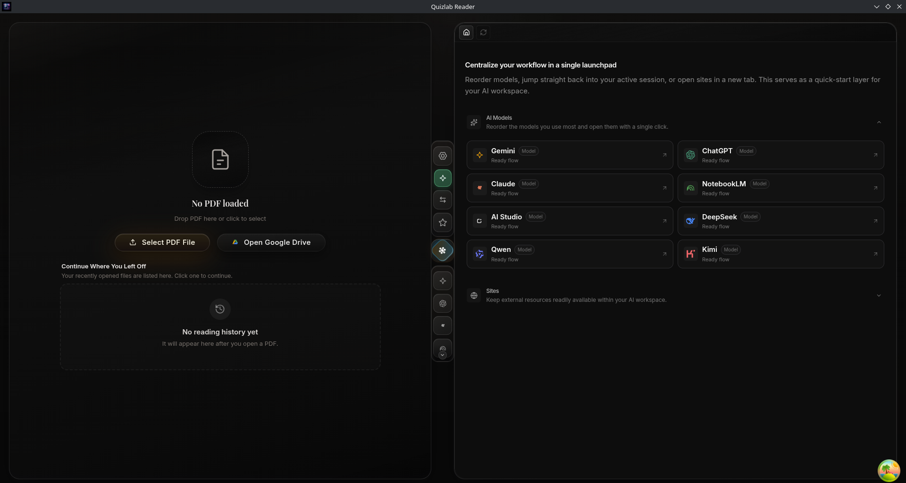
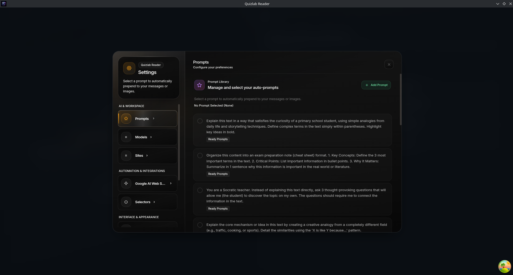
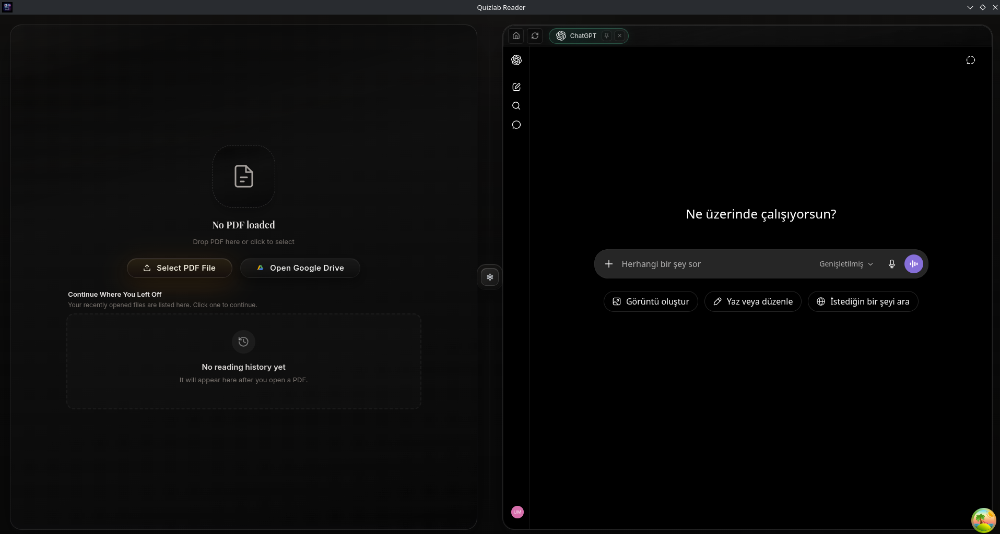
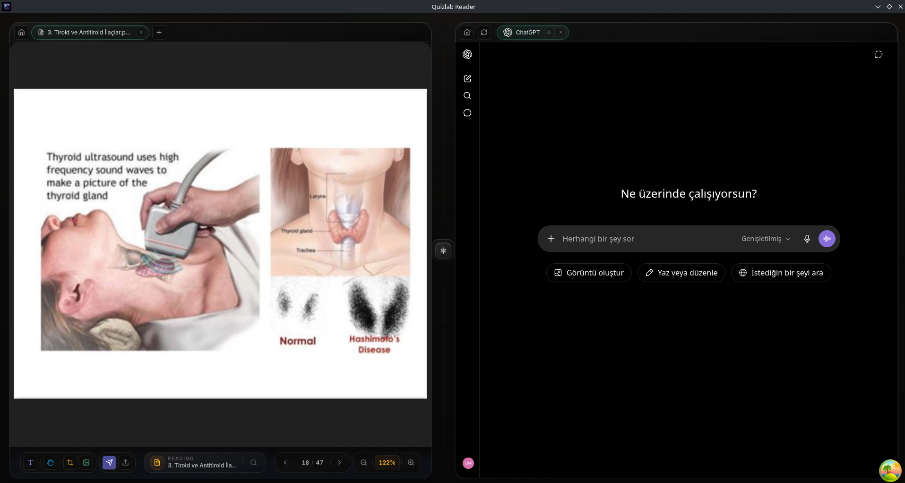
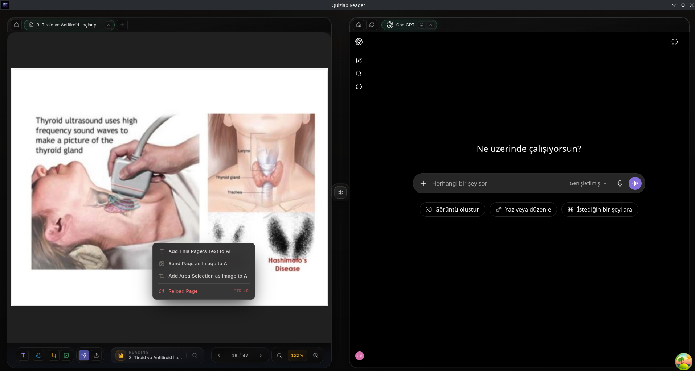
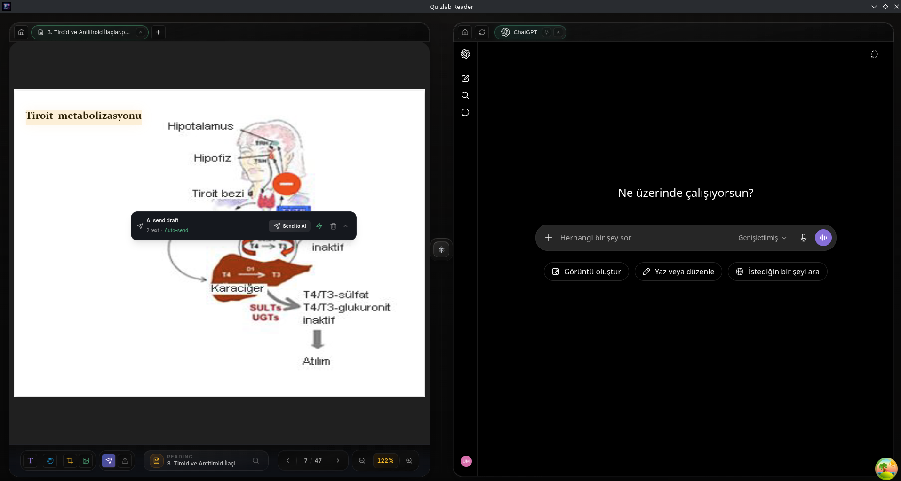

# QuizLab Reader: Yapay Zeka Destekli PDF Okuyucu, Quiz Üretici ve Çalışma Alanı

<p align="center">
  
</p>

<p align="center">
  <strong>QuizLab Reader, aktif hatırlama, quiz üretimi ve odaklı çalışma akışları için geliştirilmiş yapay zeka destekli bir PDF okuyucudur.</strong>
</p>

<p align="center">
  <a href="README.md">English README</a> |
  <a href="https://github.com/ozymandias-get/quizlab/releases">Son Sürüm</a> |
  <a href="CONTRIBUTING.md">Katkı</a> |
  <a href="SECURITY.md">Güvenlik</a>
</p>

<p align="center">
  
  
  
  
</p>

## Ekran Görüntüleri

### PDF Çalışma Alanı ve Yapay Zeka Ana Ekranı

Bu görünüm, solda PDF okuyucuyu ve sağda yapay zeka ana ekranını aynı anda gösteren ana yerleşimi gösterir.

<p align="center">
  
</p>

### Yapay Zeka Modelleri ve Siteler

Bu ekran, çalışma alanında hazır yapay zeka modellerinin ve eklenen özel sitelerin listelendiği bölümü gösterir.

<p align="center">
  
</p>

### Prompt Kütüphanesi Ayarları

Bu ekran, kayıtlı promptları yönetme ve otomatik prompt akışını seçme bölümünü gösterir.

<p align="center">
  
</p>

### PDF ve ChatGPT Hızlı İşlemleri

Bu görünüm, PDF okuyucuyu, ChatGPT panelini ve belge yanında yer alan hızlı işlem araçlarını birlikte gösterir.

<p align="center">
  
</p>

### Yapay Zekaya Gönderim Taslağı

Bu pencere, seçilen PDF içeriğinin aktif yapay zeka sekmesine gönderilmeden önce gözden geçirildiği alanı gösterir.

<p align="center">
  
</p>

### Otomatik Gönderim Etkin

Bu görünüm, seçilen içeriğin aktif yapay zeka oturumuna doğrudan gönderildiği otomatik gönderim akışını gösterir.

<p align="center">
  
</p>

## Genel Bakış

QuizLab Reader; PDF okuyucu, yapay zeka web çalışma alanı ve interaktif quiz üreticisini tek bir Electron masaüstü uygulamasında birleştirir. Tıp öğrencileri, sınav adayları ve PDF ile yoğun çalışan kullanıcılar için pasif okumayı aktif hatırlamaya çevirmeyi hedefler.

Bir PDF uygulaması, tarayıcı sekmeleri, notlar ve quiz araçları arasında gidip gelmek yerine QuizLab bütün çalışma döngüsünü tek yerde toplar:

- PDF sekmeleri açma ve yönetme
- Seçili metni tek tıkla yapay zekaya gönderme
- Açık PDF veya seçili içerikten quiz üretme
- Açıklamalar ve zayıf alanlarla soru gözden geçirme
- Yapay zeka oturumlarını ve yerel çalışma verilerini cihazda tutma

## Neden QuizLab Reader

QuizLab genel amaçlı bir sohbet arayüzü değil, gerçek çalışma akışları etrafında tasarlanmış bir üründür.

- Yapay zeka destekli PDF okuyucu: belge bağlamından kopmadan okuma ve inceleme
- Sınav ve tekrar için quiz üretici: PDF içeriğini aktif hatırlama sorularına çevirme
- Bölünmüş ekran masaüstü düzeni: solda PDF, sağda yapay zeka
- Yerel odaklı Electron uygulaması: dosyalar cihazda kalır, AI erişimi kendi hesaplarınızla olur
- Çoklu AI desteği: Gemini, ChatGPT, Claude, DeepSeek, Qwen, Kimi, NotebookLM ve AI Studio

## Temel Özellikler

### Bölünmüş ekran PDF ve AI çalışma alanı

- Çoklu PDF sekmesi
- Sürükle bırak ile PDF açma
- Sayfa geçişi, yakınlaştırma, arama ve metin seçme
- Son okuma durumunu hatırlama
- Seçili metni anında AI tarafına gönderme

### Yapay zeka destekli quiz oluşturma

QuizLab yalnızca bir prompt kutusu değil, yapılı bir quiz akışı sunar.

- Çoktan seçmeli sorular
- Olumsuz sorular
- İfade tabanlı sorular
- Sıralama soruları
- Boşluk doldurma
- Eşleştirme soruları
- Klinik akıl yürütme odaklı sorular
- Zorluk, soru sayısı, dil ve konu odağı ayarları

### AI webview çalışma alanı

Yerleşik AI kaydı şu platformları içerir:

- ChatGPT
- Gemini
- NotebookLM
- AI Studio
- YouTube
- Claude
- DeepSeek
- Qwen
- Kimi

Uygulama ayrıca özel AI veya site eklemeyi, gerekirse seçici tabanlı web otomasyonunu da destekler.

### AI anasayfa ve sabit sekme akışı

Güncel sürümde özel bir AI anasayfası ve gelişmiş sekme yönetimi bulunur:

- Açık sekmeler, yerleşik AI modelleri ve özel siteler için anasayfa
- Sabitlenen AI sekmelerinin yeniden yüklenmesi
- Gereksiz webview açılışlarını azaltan daha temiz başlangıç
- Izgara tabanlı model sıralama
- Aktif AI sekmesi kalmadığında otomatik anasayfaya dönüş

### Gemini web session araçları

QuizLab, Google tabanlı yüzeyler için ayrı bir Gemini web oturumu yönetimi sunar.

- Oturum durumu izleme
- Elle kontrol ve yeniden kimlik doğrulama
- Gemini ailesi yüzeyleri için paylaşılan Google oturumu
- Gemini, NotebookLM, AI Studio ve ilgili Google web yüzeyleri için destek

### Ekran görüntüsünden AI akışı

- Tam sayfa yakalama
- Kırpılarak alan seçme
- Aktif AI oturumuna hızlı gönderim
- Kopyalanamayan PDF grafik ve şekilleri için kullanım

### Görünüm ve çalışma deneyimi

- Ayarlanabilir alt bar boyutu ve opaklığı
- Panel yer değiştirme desteği
- Animasyonlu veya düz arka plan
- Özelleştirilebilir seçim rengi
- Rehberli ilk kullanım turu
- İngilizce ve Türkçe arayüz

## Kurulum

### Sistem gereksinimleri

| Öğe | Minimum | Önerilen |
| --- | --- | --- |
| İşletim sistemi | Windows 10, macOS 10.15, Ubuntu 20.04 | Windows 11, macOS 13, Ubuntu 22.04 |
| RAM | 4 GB | 8 GB veya üstü |
| Depolama | 500 MB | 2 GB veya üstü |
| İnternet | AI özellikleri için gerekli | Stabil genişbant |

### Hazır sürümü indirme

En güncel yükleyiciyi GitHub releases sayfasından indirebilirsiniz:

[QuizLab Reader Releases](https://github.com/ozymandias-get/quizlab/releases)

Tipik çıktılar:

- Windows: `QuizlabReader-Setup-<version>.exe`
- macOS: `QuizlabReader-<version>.dmg`
- Linux: `QuizlabReader-<version>.AppImage`

### Kaynaktan çalıştırma

```bash
git clone https://github.com/ozymandias-get/quizlab.git
cd quizlab
npm install
npm run dev
```

Üretim derlemesi:

```bash
npm run build
```

Platform paketleri:

```bash
npm run build:win
npm run build:mac
npm run build:linux
```

## Hızlı Başlangıç

### 1. Uygulamayı açın ve PDF yükleyin

- PDF seç butonunu kullanın veya dosyayı pencereye bırakın
- Son okuma bilgisiyle önceki belgeye hızla dönün

### 2. AI çalışma alanını seçin

- Anasayfadan yerleşik bir AI sekmesi açın
- Ya da ayarlardan özel AI veya site ekleyin

### 3. Quiz üretimi için Gemini CLI bağlayın

Quiz üretimi Gemini CLI üzerinden çalışır.

```bash
npm install -g @google/gemini-cli
gemini login
```

Gerekirse uygulama ayarlarında Gemini CLI yolunu düzenleyin.

### 4. Quiz oluşturun

- Gerekirse PDF içinden metin seçin
- Quiz akışına girin
- Zorluk, soru sayısı ve stili seçin
- Soruları oluşturup inceleme moduna geçin

### 5. Gerekirse web session araçlarını kullanın

Google AI yüzeyleri kullanıyorsanız Ayarlar > Gemini Web alanından:

- oturum sağlığını kontrol edebilir
- yeniden giriş akışını başlatabilir
- paylaşılan Google web oturumunu yönetebilirsiniz

## Geliştirme

### Temel komutlar

```bash
npm run dev
npm run dev:web
npm run build:backend
npm run typecheck
npm run lint
npm run test
npm run test:e2e
npm run build
```

### Güncel geliştirme notları

- `npm run dev`, Vite renderer ve Electron uygulamasını birlikte başlatır
- Dev scripti, `5173` portunda zaten çalışan QuizLab Vite sunucusunu tekrar kullanabilir
- Güncel dev akışı, mevcut Electron ve Chromium profilini korur; web oturum verilerini otomatik silmez
- GPU hızlandırma bayrakları Electron açılışında etkinleştirilir

## Mimari

QuizLab katmanlı bir Electron ve React mimarisi kullanır.

```text
electron/
  app/                     Ana süreç girişi, pencereler, IPC kaydı
  core/                    Yapılandırma, güncelleyici, yardımcılar
  features/
    ai/                    AI kaydı ve platform tanımları
    automation/            Seçici ve otomasyon yardımcıları
    gemini-web-session/    Paylaşılan Google web oturumu yönetimi
    pdf/                   Güvenli PDF protokolü ve handlerlar
    quiz/                  Gemini CLI quiz hattı
    screenshot/            Yakalayıcı handlerlar
  preload/                 Context bridge API

src/
  app/                     Uygulama kabuğu ve providerlar
  features/
    ai/                    AI anasayfası, oturumlar, webviewler
    pdf/                   PDF görüntüleyici ve okuma akışları
    quiz/                  Quiz ayarı, oyun, inceleme, sonuçlar
    settings/              Ayarlar modal ve sekmeleri
    screenshot/            Ekran görüntüsü UI
    tutorial/              İlk kullanım
  platform/electron/       Renderer ile preload köprüsü
  shared/                  Ortak UI, hook, sabit, i18n

shared/
  constants/               Süreçler arası sabitler
  types/                   Ortak kontratlar ve IPC tipleri
```

## Güvenlik ve Gizlilik

QuizLab tasarım olarak yerel odaklıdır.

- PDF dosyaları yerel olarak ele alınır
- Renderer kodu preload bridge arkasında izole edilir
- Electron IPC ana süreçte doğrulanır
- AI kullanımı kendi web oturumlarınız veya Gemini CLI kurulumunuz üzerinden ilerler
- PDF yükleme için rastgele dosya yollarını açmak yerine özel Electron protokolü kullanılır

Güncel güvenlik politikası ve bildirim süreci için [SECURITY.md](SECURITY.md) dosyasına bakın.

## Yapılandırma

Başlıca ayar alanları:

- Promptlar
- Modeller
- Siteler
- Gemini CLI
- Gemini Web
- Seçiciler
- Görünüm
- Dil
- Hakkında

Yerelde saklanan veri örnekleri:

- özel AI kayıtları
- quiz tercihleri
- Gemini web session durumu
- son okuma bilgisi
- sabit AI sekmeleri
- yerleşim ve görünüm tercihleri

## Sorun Giderme

### Quiz üretimi çalışmıyor

- Gemini CLI kurulumunu kontrol edin
- `gemini login` çalıştırın
- PDF dosyasının okunabilir ve şifresiz olduğundan emin olun

### AI sayfası boş açılıyor veya prompt göndermiyor

- Aktif AI sekmesini yenileyin
- Platformun giriş isteyip istemediğini kontrol edin
- Özel sitelerde seçicileri yeniden yapılandırın
- Hedef servisin girdi akışının değişmediğini doğrulayın

### Gemini web session bozuk veya yeniden giriş istiyor

- Ayarlar > Gemini Web ekranını açın
- Elle kontrol çalıştırın
- Google oturumunu yeniden doğrulayın
- Profili sadece temiz bir Google oturumu istiyorsanız sıfırlayın

### `npm run dev` mevcut sunucuyu kullanıyor

Eğer `5173` portunda QuizLab Vite sunucusu açıksa bu beklenen davranıştır.

## Katkı

QuizLab; ürün özellikleri, dokümantasyon, hata düzeltmeleri, testler ve platform iyileştirmeleri için katkılar kabul eder.

Pull request açmadan önce:

```bash
npm run typecheck
npm run lint
npm run test
```

Detaylar [CONTRIBUTING.md](CONTRIBUTING.md) içindedir.

## Lisans

QuizLab Reader [MIT Lisansı](LICENSE) ile yayınlanır.
