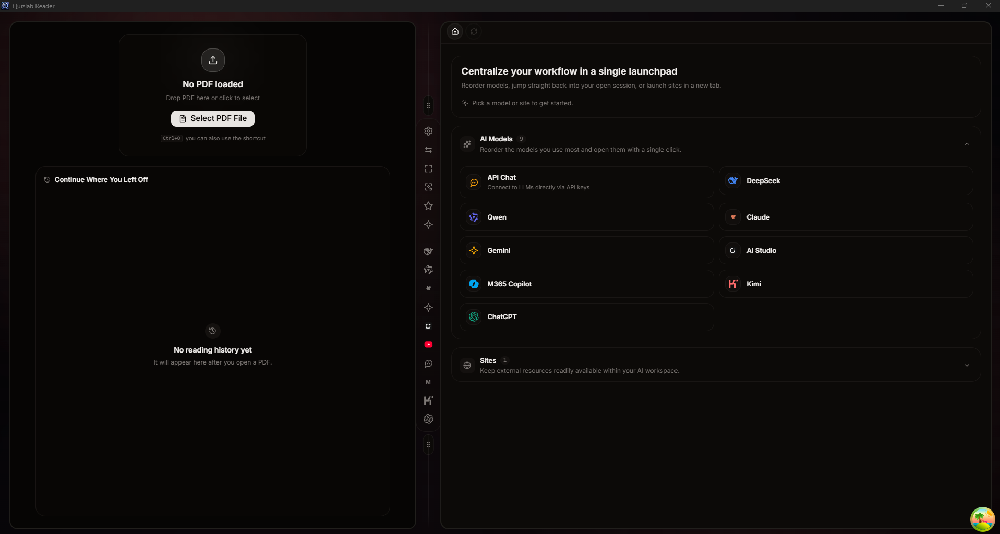
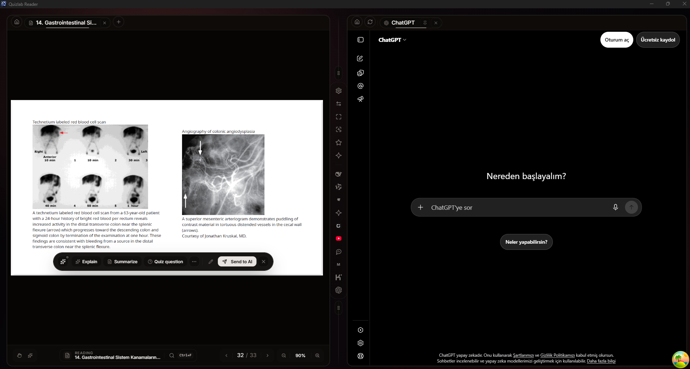
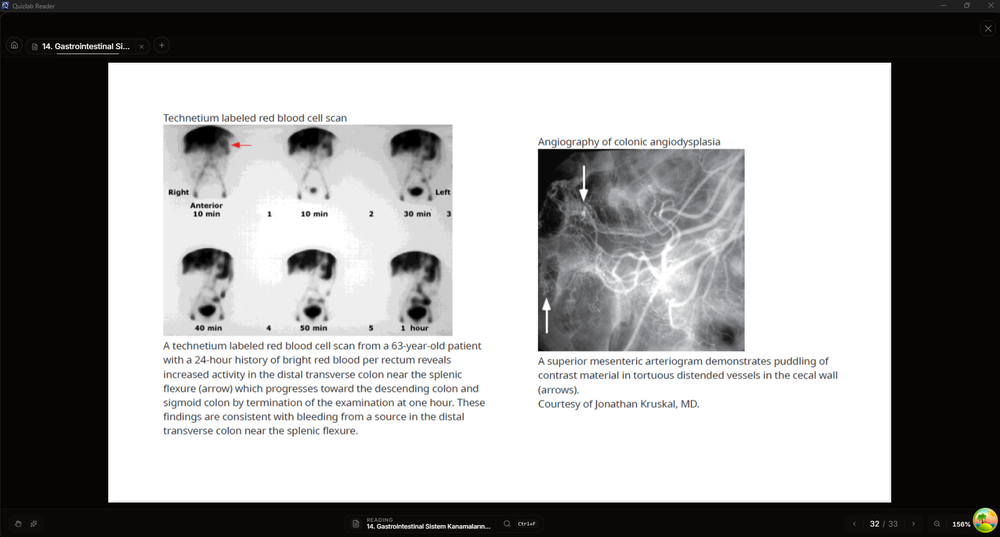
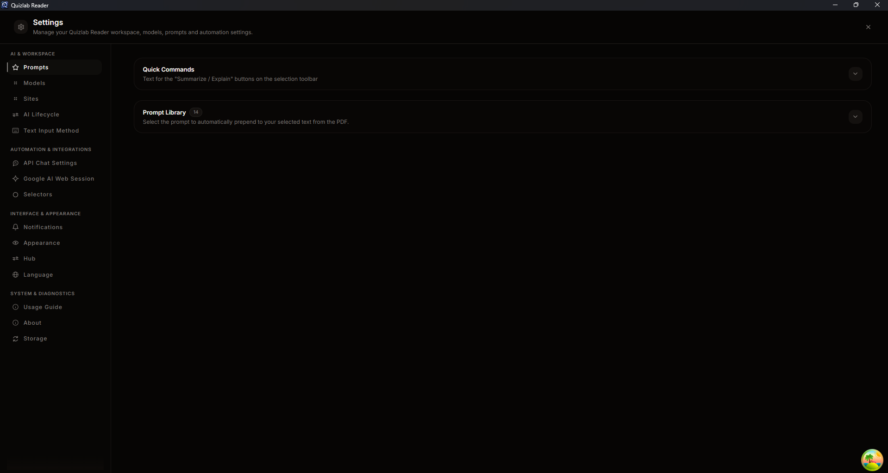
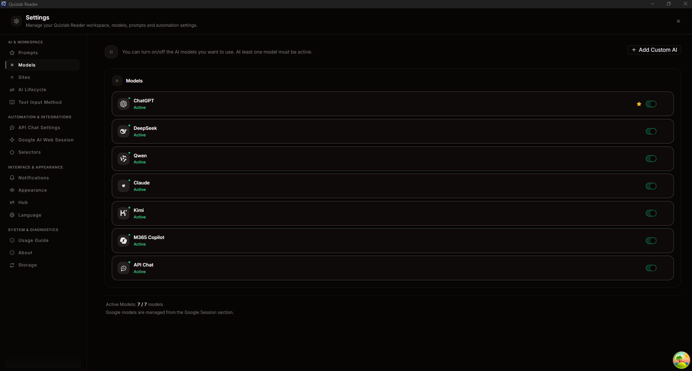
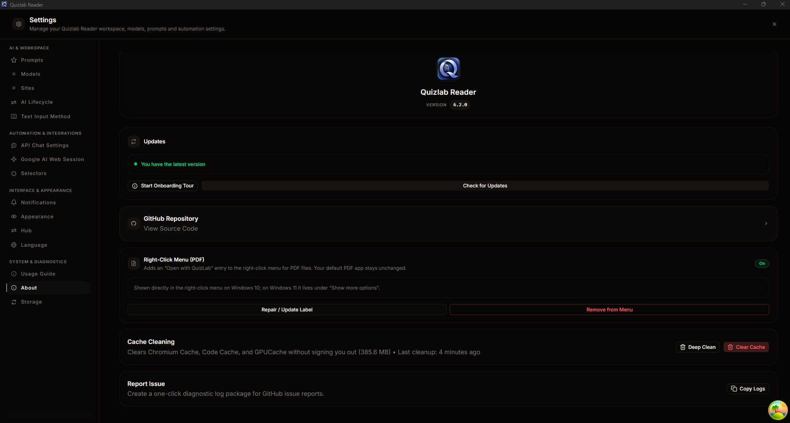

# Quizlab Reader

<p align="center">
  PDF'leri yapay zeka asistanlarıyla yan yana okumak için yerel odaklı masaüstü çalışma alanı.
</p>

<p align="center">
  <a href="README.md">English</a>
  &nbsp;•&nbsp;
  <a href="https://github.com/ozymandias-get/quizlab/releases">Sürümler</a>
  &nbsp;•&nbsp;
  <a href="CONTRIBUTING.md">Katkıda bulunma</a>
  &nbsp;•&nbsp;
  <a href="SECURITY.md">Güvenlik</a>
  &nbsp;•&nbsp;
  <a href="docs/ARCHITECTURE.md">Mimari</a>
  &nbsp;•&nbsp;
  <a href="docs/ROADMAP.md">Yol haritası</a>
  <br>
  
</p>

---

## Genel bakış

Quizlab Reader, bir PDF görüntüleyici ile bir dizi yapay zeka asistanını tek
pencerede tutar. Sol panel çok sekmeli bir PDF çalışma alanıdır; sağ panel ise
sekme sekme düzenlenmiş, her biri kendi kalıcı Chromium oturumuna sahip izole
`<webview>`'lerden oluşan yapay zeka oturumlarıdır. Seçilen metin, sayfa
görüntüleri ve kırpılmış ekran görüntüleri yüzen bir gönderme bileşeninde
toplanır ve DOM otomasyonu ile aktif yapay zeka sekmesine iletilir; böylece
okuduğunuz belgeden çıkmak zorunda kalmazsınız.

Uygulama; makale, ders notu ve kitap okuyup bunlar hakkında bir yapay zekaya
sorular soran kişiler için tasarlanmıştır. Paketlenmiş bir analiz (telemetri)
SDK'sı yoktur ve belgeleriniz hiçbir zaman yüklenmez: uygulamanın yazdığı her
şey kendi kullanıcı verisi klasöründe, kendi makinenizde kalır. Ağ trafiği
yalnızca sizin yönlendirdiğiniz yerlerde oluşur: açtığınız yapay zeka siteleri,
yapılandırdığınız model sağlayıcıları, yerel çerez köprüsü ve güncelleme bildirimi
için GitHub Releases sorgusu.

## Ekran görüntüleri

**Çalışma alanı ana ekranı** — kayıtlı tüm modeller ve siteler tek bir başlangıç
panelinde, yanında PDF paneli ve araç merkezi:



**Okuma ve gönderme** — solda bir PDF sayfası, sağda ChatGPT, altında hızlı
istemler hazır gönderme bileşeni:



**Odak modu** — aynı belge, AI paneli olmadan tam genişlikte:



**Ayarlar** — ayarlar penceresi sekmelerini "YZ ve Çalışma Alanı", "Entegrasyon
ve Otomasyon", "Arayüz ve Görünüm" ve "Uygulama ve Geliştirici" başlıklarına
ayırır.

Promptlar — hızlı komutlar ve prompt kütüphanesi:



Modeller — kullandığınız modelleri etkinleştirin, sıralayın, sabitleyin ya da
kendi modelinizi ekleyin:



Hakkında — sürüm, güncelleme denetimi, Windows sağ tık menüsü, önbellek temizliği
ve tanılama araçları:



## Özellikler

- **Çok sekmeli PDF çalışma alanı** — belge açma, yeniden adlandırma, kapatma,
  arama, yakınlaştırma, sayfa gezinme, okuma ilerlemesi geçmişi, sürükle-bırak ve
  bir Google Drive sekmesi. `Ctrl/Cmd+O` dosya açar, `Ctrl/Cmd+F` aramaya odaklanır.
- **Bölünmüş ekran düzeni** — sürüklenebilir ayraç PDF/yapay zeka oranını ayarlar,
  odak modu ise iki tarafı da tam genişliğe açar.
- **Sekmeli yapay zeka oturumları** — ChatGPT, Gemini, AI Studio, YouTube,
  DeepSeek, Qwen, Claude, Kimi ve M365 Copilot hazır olarak kayıtlıdır; kendi
  siteleriniz de eklenebilir. Her site kendi kalıcı oturumunda çalışır, böylece
  girişler yeniden başlatmalardan sonra korunur. `API Chat` sekmesi ise uygulama
  içinde çizilen yerel bir sohbet yüzeyi sunar. Gemini, AI Studio ve YouTube
  yalnızca Google oturumu **Ayarlar → Google AI Web Oturumu** bölümünde etkinken
  listelenir.
- **Gönderme bileşeni** — seçilen metin, sayfanın tamamı görüntü olarak, seçim
  dikdörtgeni ya da kırpılmış ekran görüntüsü kuyruğa alınır ve sırayla
  iletilir. Otomatik Gönderim genel bir tercihtir: kapalıyken uygulama yalnızca
  içeriği hazırlar, gönderme düğmesine siz basarsınız.
- **Hızlı istemler** — hazır sekiz ön ayar (açıkla, özetle, quiz, flashcard,
  terimler, mekanizma, klinik, tekrar); gönderilen mesajın başına otomatik bir
  istem ekler. Etiketler ve istem metinleri kullanıcı tarafından düzenlenebilir.
- **Magic Picker** — herhangi bir yapay zeka sitesinde sohbet giriş alanını ve
  gönderme düğmesini CSS yazmadan fareyle seçin. Seçiciler ana makine adına göre
  saklanır ve kendini onarır: kayıtlı seçici bozulduğunda çalışma zamanı yeni bir
  seçici bulur ve güven eşiği ile titreme kontrolünden geçtikten sonra, hattı
  gerçekten tamamlayabildiğinde bunu kalıcılaştırır.
- **Doğrudan API sohbeti** — kendi API anahtarınızı kullanın ve OpenAI uyumlu
  `/chat/completions` ve `/models` uç noktaları üzerinden modellerle konuşun.
  OpenAI, Anthropic, Google ve NVIDIA için hazır sağlayıcı şablonları gelir;
  `custom` ise uyumlu herhangi bir geçidi kapsar. İstekler SSRF doğrulaması ve
  DNS sabitleme ile ana süreçten yapılır.
- **Google AI web oturumu** — Gemini, AI Studio ve YouTube, ayrılmış bir oturum
  bölümünde tutulan tek bir Google oturumunu paylaşır; periyodik sağlık
  kontrolleri ve şifrelenmiş dışa/içe aktarma desteklenir. Paketlenmiş Chrome
  eklentisi mevcut Google çerezlerini yerel köprü üzerinden devredebilir.
- **Görünüm** — animasyonlu veya düz arka planlar, cam ölçeği, seçim rengi, vurgu
  rengi ve gerçekten kullandığınız araçlar için yapılandırılabilir merkez (hub).
- **Dil** — İngilizce ve Türkçe; ilk çalıştırmada seçilir, ayarlardan değiştirilir.
  Dil başına 19 alan adı JSON dosyası vardır.
- **Depolama ve önbellek yönetimi** — ölçülen önbellek toplamı, zamanlanmış temizlik
  ve 500 MB bütçesinin %80'inde uyarı balonu.
- **Güncelleme bildirimi** — başlangıçtan yaklaşık beş saniye sonra GitHub
  Releases API'sini sorgular, semver karşılaştırması yapar ve sürüm sayfasına
  bağlantı sunar. Hiçbir şey indirmez veya kurmaz.
- **Rehberli turlar** — beş hazır tur (genel, PDF, yapay zeka, ayarlar, Magic
  Picker) ve ayarlarda bir Kullanım Rehberi sayfası.
- **Windows kabuk entegrasyonu** — `.pdf` dosyaları için Gezgin sağ tık menüsünde
  isteğe bağlı bir "QuizLab ile Aç" girdisi; varsayılan PDF uygulamanız değişmez.

## Teknoloji altyapısı

| Alan                    | Seçim                                                                                     |
| ----------------------- | ----------------------------------------------------------------------------------------- |
| Masaüstü çalışma zamanı | Electron 42                                                                               |
| Arayüz                  | React 19; yönlendirici yok (özel durum tabanlı çalışma alanı)                             |
| Dil                     | TypeScript 5.9                                                                            |
| Derleme                 | Vite 8 (renderer), `tsc` + esbuild (main/preload), electron-builder (paketleme)           |
| PDF motoru              | `pdfjs-dist` 3.11 + `@react-pdf-viewer` 3.12 (core, page-navigation, search, zoom)        |
| Stil                    | Tailwind CSS 4 (`@theme` token'ları) ve az sayıda CSS modülü                              |
| Durum                   | Bileşenler arası durum için Zustand 5, IPC üzerinden okumalar için TanStack React Query 5 |
| Arayüz primitifleri     | Radix UI, Headless UI, shadcn/ui, Lucide ikonlar                                          |
| Animasyon / efekt       | Motion, tsParticles, Inter Variable (Fontsource)                                          |
| i18n                    | i18next + react-i18next                                                                   |
| Test                    | Vitest 4 + Testing Library                                                                |
| Lint / biçimlendirme    | ESLint 10, Prettier, Stylelint, cspell, dependency-cruiser                                |
| Güvenlik araçları       | Electronegativity, Semgrep, `npm audit`                                                   |
| Paketleme               | electron-builder 26 — NSIS (Windows), dmg/zip (macOS), AppImage/deb (Linux)               |

## Gereksinimler

**Uygulamayı çalıştırmak için**

- Windows 10/11 (x64) — yayınlanan yükleyici kullanıcı düzeyinde bir NSIS
  paketidir. Gezgin sağ tık menüsü girdisi ve Chrome eklenti köprüsü yalnızca
  Windows'ta çalışır.
- macOS — `dmg`/`zip` hedefleri yapılandırılmıştır ancak sürüm iş akışı macOS
  derlemesi yapmaz; `npm run build:mac` ile yerelde üretin.
- Linux — AppImage ve `deb` CI tarafından derlenir.
- Yapay zeka özellikleri için ağ bağlantısı gerekir. PDF okumak için başka hiçbir
  şey gerekmez.

**Kaynaktan derlemek için**

- Node.js `20.19+`, `22.12+` veya `24+` (CI 24 kullanır; Vite ve Vitest'in
  `engines` aralıkları bazı ara sürümleri dışlar)
- npm — kilit dosyası `package-lock.json`, CI `npm ci` kullanır
- Git
- Yalnızca Google AI web oturumunu istiyorsanız Google hesabı
- Yalnızca doğrudan API sohbetini istiyorsanız API anahtarları
- Yalnızca oturum köprüsü eklentisini istiyorsanız Google Chrome

## Kurulum

Platformunuz için yükleyiciyi [Sürümler](https://github.com/ozymandias-get/quizlab/releases)
sayfasından indirin.

| Platform | Dosya                                                                               |
| -------- | ----------------------------------------------------------------------------------- |
| Windows  | `QuizLab-Setup-<version>-x64.exe` — NSIS, kullanıcı düzeyinde, yönetici gerektirmez |
| Linux    | `.AppImage` (doğrudan çalıştırın) veya `.deb` (`dpkg` ile kurun)                    |
| macOS    | CI derlemez — `npm run build:mac` ile yerelde üretin                                |

Windows yükleyicisi imzasızdır, bu yüzden ilk çalıştırmada SmartScreen uyarısı
gösterebilir. Kullanıcı düzeyinde kurulur, hiçbir zaman yetki istemez ve
kaldırma sırasında `%AppData%\Quizlab Reader` yerinde bırakılır. Gezgin bağlam
menüsü ve kod imzalama hazırlığı dahil eksiksiz kurulum anlatısı için
[docs/windows-installer.md](docs/windows-installer.md) dosyasına bakın.

## Yapılandırma

Neredeyse her şey uygulama içinden yapılandırılır. Düzenlenecek bir yapılandırma
dosyası ve bir `.env` yükleyicisi yoktur: Electron ana süreci doğrudan
`process.env` okur, dolayısıyla değişkenleri onu başlatan kabukta dışa aktarmanız
gerekir. `.env.example` varsayılanlarla birlikte listenin tamamını belgeler;
geliştirmede önemli olanlar:

| Değişken                        | Etkisi                                                                                 |
| ------------------------------- | -------------------------------------------------------------------------------------- |
| `APP_RENDERER_URL`              | Ana pencerenin yüklediği geliştirme sunucu adresi (varsayılan `http://localhost:5173`) |
| `APP_OPEN_DEVTOOLS=1`           | Başlangıçta DevTools'u aç                                                              |
| `QUIZLAB_PROFILE`               | Kullanıcı verisi dizini son eki (aşağıya bakın)                                        |
| `QUIZLAB_USER_DATA_DIR`         | Kullanıcı verisi için mutlak yol geçersiz kılma                                        |
| `QUIZLAB_DISABLE_GPU=1`         | Donanım hızlandırmayı kapat                                                            |
| `QUIZLAB_EXTENSION_BRIDGE_PORT` | Chrome çerez köprüsü için yerel port (varsayılan `51999`)                              |
| `GEMINI_WEB_*`                  | Google oturumu sağlık kontrol aralıkları ve zaman aşımları                             |

`stable` dışında bir `QUIZLAB_PROFILE` kullanmak tek örnekli kilidi de devre dışı
bırakır; bu, iki profili yan yana çalıştırmak için kullanışlıdır.

**Veriler nerede durur.** Uygulama her şeyden önce kullanıcı verisi dizinini
taşıdığı için profiller birbirine karışmaz:

| Profil   | Dizin                                                              |
| -------- | ------------------------------------------------------------------ |
| `stable` | `<appData>/Quizlab Reader` — Windows'ta `%AppData%\Quizlab Reader` |
| `dev`    | `<appData>/Quizlab Reader Dev` (paketlenmemiş çalıştırmalar)       |
| diğer    | `<appData>/Quizlab Reader <profil>`                                |
| geçersiz | `QUIZLAB_USER_DATA_DIR`                                            |

Bu dizinin içinde: JSON yapılandırma dosyaları, `Partitions/<ad>/` Chromium
oturum ve önbellek verisi, `logs/` ve yüklenmiş Chrome eklentisinin kopyası.
Veritabanı yoktur.

**API anahtarları** `api_chat_config.json` içinde (`0600` modunda) saklanır;
işletim sistemi anahtar deposu varsa Electron `safeStorage` ile, yoksa makine
parmak izinden PBKDF2 ile türetilen anahtarla AES-256-GCM kullanılarak
şifrelenir. Yedek yöntem değeri diskte yalnızca gizler; makine profilinize
erişimi olan biri için anahtar deposunun yerine geçmez.

## Kullanım

1. Uygulamayı başlatın. İlk çalıştırmada dil seçin; ardından genel tur başlar.
2. Sol panele bir PDF bırakın veya `Ctrl/Cmd+O` tuşlarına basın. Belge başına bir
   sekme açılır.
3. Sağdaki ana panelden bir yapay zeka sitesi açın veya **Ayarlar → Siteler**
   altından kendi sitenizi ekleyin. Bir kez giriş yapın; oturum hatırlanır.
4. PDF içinde metin seçin veya sayfaya sağ tıklayıp _Add This Page's Text to
   AI_ / _Send Page as Image to AI_ / _Add Area Selection as Image to AI_
   seçeneklerinden birini kullanın.
5. İçerik gönderme bileşeninde birikir. İsterseniz bir hızlı istem seçin, sonra
   **Send to AI** düğmesine basın.
6. Her seferinde sitede gönder düğmesine basmak istemiyorsanız bileşendeki
   **Otomatik Gönderim** anahtarını açın.
7. Bir sitenin düzeni değişirse o sekmede **Magic Picker**'ı çalıştırıp giriş
   alanını yeniden seçin. Siz seçene kadar uygulama yanlış öğeye yazmak yerine
   göndermeyi reddeder.

## Mimari

```
Renderer (src/)
  React çalışma alanı: PDF paneli, yapay zeka webview paneli,
  gönderme bileşeni, ayarlar
  hook'lar + window.electronAPI üzerinde TanStack Query
        |  tipli invoke (kanal -> istek/sonuç tipleri)
        v
Preload (electron/preload/)
  contextBridge: izin verilen her kanal için tek açık metot, fazlası yok
        |  ipcRenderer.invoke
        v
Main (electron/)
  ipcMain handler'ları, her çağrıda güvenilir gönderici kontrolü
  özellik modülleri: ai, automation, gemini-web-session, native-messaging,
                     pdf, screenshot, settings, shell-open
  core: yapılandırma deposu, şifreleme, CSP, günlükleme, önbellek, güncelleyici
        |
        +--> local-pdf:// protokolü -> yerel PDF dosyaları (izin listesi, bayt aralıkları)
        +--> Chromium bölümleri   -> her yapay zeka sitesi için çerez ve önbellek
        +--> model sağlayıcı HTTP -> doğrudan API sohbeti (SSRF doğrulamalı)
        +--> GitHub Releases API  -> güncelleme bildirimi
```

Ortak sözleşmeler `shared/` dizininde durur ve `@shared-core/*` alias'ı üzerinden
iki tarafça da içe aktarılır: kanal adları (`shared/constants/ipcChannels.ts`),
istek/sonuç haritası (`shared/types/ipcContract.ts`) ve paylaşılan alan tipleri.

Değişiklik yapmadan önce bilinmesi gereken iki tasarım noktası: gezinme durumdur,
yönlendirme değil — bir yönlendirici yoktur ve PDF sekmeleri (Zustand) ile
yapay zeka sekmeleri (bölünmüş context'ler arkasında `useState`) birbirinden
bağımsızdır; ve her yapay zeka etkileşimi, harici bir tarayıcıyı sürmek yerine
ana süreçte JavaScript üretip bunu hedef `<webview>` içinde çalıştırarak gerçekleşir.

Katman sınırları, dependency-cruiser'ın uyguladığı import kuralları ve seçici
kendini onarma akışı için [docs/ARCHITECTURE.md](docs/ARCHITECTURE.md)
dosyasına bakın.

## Proje yapısı

```
electron/            Ana süreç
  app/               Giriş noktası, pencere oluşturma, oturum/CSP/güvenlik, IPC bağlantısı
  core/              Yapılandırma deposu, şifreleme, günlükleme, önbellek, güncelleyici, tipli IPC
  features/          Özellik handler'ları (ai, automation, gemini-web-session,
                     native-messaging, pdf, screenshot, settings, shell-open)
  preload/           contextBridge yüzeyi
  __tests__/         Ana süreç testleri
shared/              Süreçler arası sözleşmeler: IPC kanalları, tipler, sabitler
src/                 Renderer
  app/               Kabuk, sağlayıcılar, uygulama efektleri, yüzen gönderme bileşeni
  features/          ai, automation, onboarding, pdf, screenshot, settings, tutorial
  platform/electron/ Uygulama ile window.electronAPI arasındaki adaptörler
  shared/            Paylaşılan arayüz, hook'lar, i18n, stiller, store'lar, lib
  __tests__/         Renderer testleri
extensions/          Google oturum köprüsü için Chrome eklentisi
installer/           NSIS özel yükleyici mantığı
scripts/             Geliştirme ve derleme otomasyonu
docs/                Mimari, kodlama standardı, terminoloji, yol haritası
```

## Geliştirme

```bash
git clone https://github.com/ozymandias-get/quizlab.git
cd quizlab
npm install
npm run dev          # Vite geliştirme sunucusu + Electron
```

`npm run dev` ana süreci derler, Vite'ı 5173 portunda başlatır (bu uygulama
orada zaten sunuluyorsa onu yeniden kullanır) ve ardından Electron'u çalıştırır.
Electron'un stderr çıktısındaki bilinen Chromium gürültüsünü süzer, geri kalanı
olduğu gibi yazar.

Diğer giriş noktaları:

| Komut                  | Ne yapar                                                          |
| ---------------------- | ----------------------------------------------------------------- |
| `npm run dev:web`      | Yalnızca Vite; renderer bir tarayıcıda sahte API'ye karşı çalışır |
| `npm run dev:electron` | Arka uç derlemesi, sonra çalışan geliştirme sunucusuna Electron   |

Kalite kapıları — hepsi CI'da çalışır:

```bash
npm run typecheck     # tsc -b (app, node, node.test projeleri)
npm run lint          # ESLint, uyarı sıfır toleranslı
npm run format:check  # Prettier
npm test              # Vitest, tüm paket
npm run test:coverage # Vitest + eşiklerle coverage
```

Analiz araçları:

```bash
npm run analyze:architecture  # dependency-cruiser import kuralları
npm run analyze:circular      # madge
npm run analyze:duplicates    # jscpd
npm run analyze:deadcode      # knip + ts-prune
npm run analyze:types         # type-coverage
npm run analyze:css           # stylelint
npm run analyze:security      # Semgrep + npm audit + Electronegativity
npm run analyze:all           # yukarıdakilerin tümü + paket raporu
```

Commit mesajları [Conventional Commits](https://www.conventionalcommits.org/)
biçimini izler ve Husky kancası üzerinden commitlint tarafından denetlenir.

## Test

Vitest her iki süreci de çalıştırır: `src/__tests__/` jsdom'da,
`electron/__tests__/` Node ortamında; seçim `vitest.config.mts` içindeki
`environmentMatchGlobs` ile yapılır. Mevcut paket 309 dosya / 3106 testtir.

Coverage eşikleri `vitest.config.mts` içinde kapsam başına uygulanır — genel
olarak satır için %50, ayrıca `electron/features/gemini-web-session`,
`electron/features/automation`, `electron/core`,
`electron/features/ai/apiChatHandlers` ve PDF özelliği için ayrı tabanlar.
`npm run analyze:mutation` ile Stryker çalıştırılır.

## Derleme

```bash
npm run build         # renderer + main + preload -> dist/
npm run build:web     # yalnızca renderer, tarayıcı önizlemesi için
npm run build:win     # ardından electron-builder --win  -> release/*.exe
npm run build:mac     # ardından electron-builder --mac  -> release/*.dmg, *.zip
npm run build:linux   # ardından electron-builder --linux -> release/*.AppImage, *.deb
```

Paketleme çıktısı `release/` dizinine gider. `app.asar` içine yalnızca
`dist/**` konur; ikonlar ve Chrome eklentisi ek kaynak olarak dağıtılır.
Windows derlemeleri varsayılan olarak imzasızdır — bunu değiştirmek için
gereken imzalama değişkenleri için
[docs/windows-installer.md](docs/windows-installer.md) dosyasına bakın.

## CI/CD

`.github/workflows/build.yml` üç iş içerir:

1. **quality** (ubuntu-latest, push ve pull request üzerinde) — depo hijyeni,
   sürüm tutarlılığı, ESLint, Prettier, CSS lint, typecheck, dependency-cruiser,
   coverage'lı testler, type-coverage denetimi, kopya kod ve döngüsel bağımlılık
   tespiti, Semgrep, üretim bağımlılık denetimi, Electronegativity. Dosya boyutu
   ve yazım denetimi çalışır ancak engelleyici değildir.
2. **build** (windows-latest ve ubuntu-22.04, etiketlerde) — Windows ve Linux
   yükleyicilerini üretir ve yapıtları artifact olarak yükler.
3. **release** (etiketlerde) — yapıtları otomatik notlarla bir GitHub
   Release'e ekler.

Etiketler `package.json` sürümüyle eşleşmelidir; `npm run ci:check-version`
bunu ve her iki README'deki sürüm rozetini de denetler.

## Güvenlik ve gizlilik

Bu derlemenin doğrulanmış özellikleri:

- **İzole renderer** — `contextIsolation: true`, `nodeIntegration: false`,
  `sandbox: true`, `webSecurity: true`; renderer tarafından verilen webview
  preload'ları soyulur ve webview tercihleri `will-attach-webview` üzerinde
  zorlanır.
- **Dar preload köprüsü** — izin verilen her IPC kanalı için tek açık metot;
  renderer'ın doğrudan Node erişimi yoktur.
- **Gönderici doğrulaması** — her IPC handler'ı ana pencerenin ana çerçevesini
  zorunlu tutar; alt çerçeveler ve webview'ler bunları çağıramaz.
- **Analiz yok** — paketlenmiş telemetri veya çökme bildirimi SDK'sı yok ve
  hiçbir şey kendiliğinden bir yere gönderilmez. Çökme raporları ve günlükler
  kullanıcı verisi klasöründeki `logs/` altına yazılır, orada kalır. Giden
  istekler yalnızca açtığınız sitelere, yapılandırdığınız sağlayıcılara, yerel
  çerez köprüsüne ve GitHub sürüm sorgusuna sınırlıdır.
- **PDF teslimi** — `local-pdf://`, süreç içi bir kayıt deposundaki opak kimlikleri
  çözer, dosyanın izin listesinde olmasını ister, istek kaynağını doğrular ve
  bayt aralıkları sunar.
- **Katı CSP** — ana çerçeveye nonce tabanlı bir politika enjekte edilir; belge
  ayrıca bir `frame-src` izin listesi bildirir.
- **Giden istek sertleştirmesi** — API sohbeti adresleri HTTPS (veya localhost)
  olmalı, özel ve ayrılmış adres uzayına karşı denetlenir, TLS SNI korunarak
  çözülen IP'ye sabitlenir ve yönlendirmeler boyunca `Authorization` başlığı
  düşürülür.
- **Köprü kimlik doğrulaması** — çerez köprüsü tam bir eklenti kaynağı ister,
  gövdeyi çalışma zamanında üretilen bir sırla HMAC-SHA256 ile imzalar ve sabit
  zamanlı karşılaştırır, 512 KB gövde sınırı uygular ve çerez alan adı izin
  listesi kullanır.
- **Electronegativity ve Semgrep** CI'da çalışır.

Bunların size **sağlamadığı** şeyler: canlı yapay zeka oturum çerezleri
Chromium'un kendi bölüm deposunda saklanır ve uygulama tarafından şifrelenmez;
makine kaynaklı AES anahtarı gizlemedir, makine profilinize erişimi olan birine
karşı koruma değildir; ve derlemeler imzasızdır.

## Katkıda bulunma

Kurulum, dal stratejisi, pull request kontrol listesi ve
[docs/CODING_STANDARD.md](docs/CODING_STANDARD.md) içindeki yazım kuralları için
[CONTRIBUTING.md](CONTRIBUTING.md) dosyasına bakın. Lütfen
[CODE_OF_CONDUCT.md](CODE_OF_CONDUCT.md) dosyasını da okuyun.

## Lisans

[MIT](LICENSE) © Quizlab Reader katkıda bulunanları.
